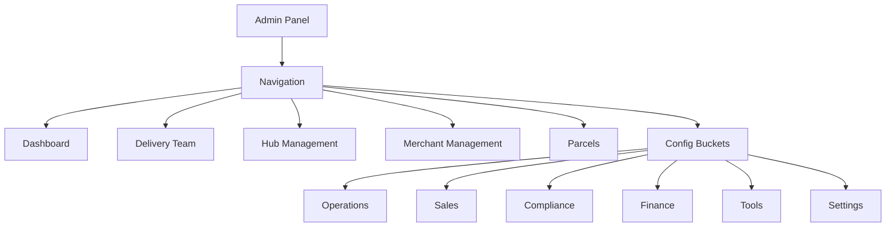
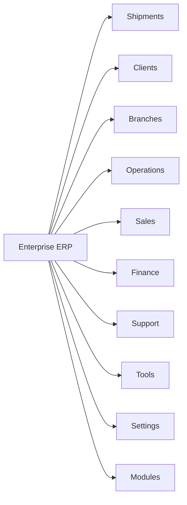

# Enterprise ERP Transformation Plan
## Baraka Courier Management System → Full Enterprise ERP

**Version:** 1.0  
**Date:** 2025-09-30  
**Status:** Planning Phase

---

## Executive Summary

This document outlines a **10-phase transformation** of the Baraka shipping/courier platform from a basic dashboard system into a comprehensive enterprise-grade ERP solution. The plan uses an **orchestrator approach**, completing each phase sequentially before moving to the next.

**Core Business Model:** Shipping & Courier Operations
**Key Terminology Change:** Merchants → Branch Managers (reflecting distributed hub/branch network)

---

## Current State Assessment

### ✅ **Strengths**
- Modern Laravel 10+ stack with Blade templating
- Config-driven navigation system ([`config/admin_nav.php`](config/admin_nav.php:1))
- Robust API v1 architecture with client/shipment management
- Permission-based RBAC with `hasPermission()` helper
- Bootstrap 5 + Tailwind hybrid styling
- Recently implemented: Dark mode, skeleton loaders, badges, quick actions

### ⚠️ **Critical Issues Identified**
1. **Language dropdown broken** - Bootstrap 4/5 class conflicts (`data-toggle` vs `data-bs-toggle`)
2. **Header layout issues** - Misaligned elements in [`navber.blade.php`](resources/views/backend/partials/navber.blade.php:1)
3. **Non-functional action buttons** - Throughout admin panels (need audit)
4. **Terminology inconsistency** - "Merchant" used instead of "Branch Manager"
5. **Incomplete API integration** - New client/shipment APIs not fully exposed in admin UI
6. **Dashboard typo** - Controller named `DashbordController` instead of `DashboardController`

### 📊 **Current Architecture**



---

## Target ERP Architecture

### **Core Business Functions**



### **Functional Pillars**

1. **Shipment Management** - Booking, tracking, routing, POD, exceptions
2. **Client Management** - Customers, contracts, quotations, address book
3. **Branch Management** - Hub network, branch managers, regional ops
4. **Operations** - Dispatch, linehaul, bags, manifests, assets
5. **Sales** - CRM, quotations, contracts, performance tracking
6. **Finance** - Invoicing, COD, settlements, rate cards, GL export
7. **Support** - Tickets, surveys, SLA tracking
8. **Tools** - Search, APIs, webhooks, observability, EDI
9. **Settings** - Users, roles, configurations, integrations
10. **Modules** - Compliance (KYC, DG, customs), Payroll, Reports

---

## 10-Phase Transformation Plan

### **PHASE 0: Critical Fixes (PREREQUISITE)**
**Duration:** 1-2 days  
**Objective:** Stabilize the platform before transformation

#### Tasks:
- [ ] Fix language dropdown Bootstrap 4/5 class conflicts
- [ ] Repair admin header layout alignment issues
- [x] Fix typo: Rename `DashbordController` → `DashboardController`
- [ ] Audit and document all non-functional action buttons
- [ ] Test and fix broken dropdown menus (profile, notifications, quick actions)

#### Acceptance Criteria:
✓ Language dropdown works in all browsers  
✓ Header elements properly aligned on mobile/desktop  
✓ All dropdown menus functional with keyboard nav  
✓ No console errors on dashboard load

---

### **PHASE 1: Navigation Restructure**
**Duration:** 3-4 days  
**Objective:** Transform sidebar into enterprise-grade nav with clear functional categories

#### Tasks:
- [ ] Create new sidebar structure with 10 main sections
- [ ] Restructure [`config/admin_nav.php`](config/admin_nav.php:1) with new hierarchy
- [ ] Add section-level icons and descriptions
- [ ] Implement collapsible mega-menus for complex sections
- [ ] Add breadcrumb navigation for deep drill-downs
- [ ] Create "Recent Items" quick access widget in sidebar
- [ ] Add keyboard shortcuts for section navigation (Alt+1-9)

#### New Navigation Structure:
```
📦 SHIPMENTS
   ├─ Book Shipment (Quick)
   ├─ All Shipments
   ├─ Bags & Manifests
   ├─ Routes & Stops
   ├─ POD Gallery
   └─ Exception Tower

👥 CLIENTS
   ├─ All Customers
   ├─ Add Customer
   ├─ Quotations
   ├─ Contracts
   └─ Address Book

🏢 BRANCHES (formerly Merchants)
   ├─ Branch Network
   ├─ Branch Managers
   ├─ Performance Dashboard
   └─ Payments & Settlements

🚚 OPERATIONS
   ├─ Dispatch Board
   ├─ Pickup Requests
   ├─ Linehaul Management
   ├─ Asset Management
   └─ Control Tower

💰 SALES
   ├─ Sales Dashboard
   ├─ Pipeline
   ├─ Proposals
   └─ Performance Reports

💵 FINANCE
   ├─ Finance Dashboard
   ├─ Rate Cards
   ├─ Invoices
   ├─ COD Receipts
   ├─ Settlements
   ├─ GL Export
   └─ Payroll

🎧 SUPPORT
   ├─ Support Tickets
   ├─ To-do List
   ├─ SLA Tracking
   └─ Surveys

🛠️ TOOLS
   ├─ Global Search
   ├─ API & Webhooks
   ├─ Observability
   ├─ WhatsApp Templates
   └─ Reports Builder

⚙️ SETTINGS
   ├─ Users & Roles
   ├─ General Settings
   ├─ Delivery Config
   ├─ Communication
   └─ Integrations

📋 MODULES
   ├─ Compliance (KYC, DG, Customs)
   ├─ Website Management
   └─ Database Backup
```

#### Acceptance Criteria:
✓ All 10 sections clearly visible with icons  
✓ Max 3-level nesting (section > group > item)  
✓ Keyboard navigable (tab, arrow keys, Enter)  
✓ Permission-filtered per user role  
✓ Mobile-responsive collapsible sidebar

---

### **PHASE 2: Terminology & Data Migration**
**Duration:** 4-5 days  
**Objective:** Rename "Merchant" to "Branch Manager" throughout codebase

#### Tasks:
- [ ] Database migration: Add `branch_manager_id` column alongside `merchant_id`
- [ ] Create `BranchManager` model extending/aliasing `Merchant`
- [ ] Update all language files: `merchant` → `branch_manager`
- [ ] Update all Blade views: Replace "Merchant" text
- [ ] Update controllers: Add `BranchManager` aliases
- [ ] Update routes: Add `branch-managers.*` aliases
- [ ] Update API resources: Add `BranchManagerResource`
- [ ] Update permissions: `merchant_*` → `branch_manager_*`
- [ ] Create migration guide for users (terminology mapping)
- [ ] Add feature flag: `use_branch_manager_terminology`

#### Files to Update:
- All `lang/*/merchant.php` files
- All `menus.merchant*` translation keys
- [`app/Models/Backend/Merchant.php`](app/Models/Backend/Merchant.php:1)
- All views in `resources/views/backend/merchant*/`
- [`config/admin_nav.php`](config/admin_nav.php:1) (line 277, 690)

#### Acceptance Criteria:
✓ All UI displays "Branch Manager" instead of "Merchant"  
✓ Old `merchant_id` FK relationships preserved (no data loss)  
✓ New `branch_manager_id` aliased for future use  
✓ Permissions backward compatible  
✓ API v1 still accepts both terms during transition

---

### **PHASE 3: Client Management Integration**
**Duration:** 5-6 days  
**Objective:** Fully integrate new Client API into admin interface

#### Tasks:
- [ ] Create admin customer management views (CRUD)
- [ ] Build customer profile page with shipment history
- [ ] Integrate address book management UI
- [ ] Add customer segmentation (VIP, regular, inactive)
- [ ] Create customer analytics dashboard
- [ ] Add bulk import/export for customers
- [ ] Implement customer communication center (email/SMS/WhatsApp)
- [ ] Build contract management interface
- [ ] Create quotation workflow UI
- [ ] Add customer credit limit tracking

#### API Endpoints to Integrate:
- `GET /api/v1/customers` → Admin customer list
- `POST /api/v1/customers` → Create customer
- `PATCH /api/v1/customers/{id}` → Update customer
- `GET /api/v1/address-book` → Manage addresses
- `GET /api/v1/contracts` → View/manage contracts
- `GET /api/v1/quotations` → Quotation pipeline

#### New Admin Routes:
```php
Route::prefix('admin/clients')->group(function() {
    Route::get('/', [ClientController::class, 'index'])->name('admin.clients.index');
    Route::get('/create', [ClientController::class, 'create'])->name('admin.clients.create');
    Route::post('/', [ClientController::class, 'store'])->name('admin.clients.store');
    Route::get('/{customer}', [ClientController::class, 'show'])->name('admin.clients.show');
    Route::get('/{customer}/edit', [ClientController::class, 'edit'])->name('admin.clients.edit');
    Route::patch('/{customer}', [ClientController::class, 'update'])->name('admin.clients.update');
    Route::delete('/{customer}', [ClientController::class, 'destroy'])->name('admin.clients.destroy');
    Route::post('/bulk-import', [ClientController::class, 'bulkImport'])->name('admin.clients.bulk-import');
});
```

#### Acceptance Criteria:
✓ Full CRUD for customers in admin panel  
✓ Customer profile shows shipment history  
✓ Address book management functional  
✓ Bulk import/export working (CSV/Excel)  
✓ All API endpoints exposed in admin UI

---

### **PHASE 4: Shipment Management Enhancement**
**Duration:** 5-6 days  
**Objective:** Complete shipment/parcel admin interface with API integration

#### Tasks:
- [ ] Enhance booking wizard with validation & auto-save
- [ ] Create shipment detail page with full status timeline
- [ ] Build bulk shipment operations UI (assign, update status, print labels)
- [ ] Implement exception handling workflow
- [ ] Add POD verification interface
- [ ] Create task assignment UI for drivers
- [ ] Build route planning & optimization interface
- [ ] Add scan event monitoring dashboard
- [ ] Implement bag & manifest management UI
- [ ] Create linehaul leg tracking interface

#### API Endpoints to Integrate:
- `GET /api/v1/shipments` → Admin shipment list with filters
- `POST /api/v1/shipments` → Create shipment from admin
- `PATCH /api/v1/shipments/{id}/status` → Update shipment status
- `GET /api/v1/dispatch/*` → Dispatch board data
- `POST /api/v1/dispatch/assign` → Assign shipments to drivers
- `POST /api/v1/dispatch/optimize` → Route optimization

#### New Views to Create:
- `admin/shipments/index.blade.php` - Enhanced shipment list
- `admin/shipments/show.blade.php` - Detailed shipment view
- `admin/shipments/bulk-actions.blade.php` - Bulk operations
- `admin/dispatch/board.blade.php` - Dispatch control center
- `admin/exceptions/tower.blade.php` - Exception management

#### Acceptance Criteria:
✓ All shipment API endpoints accessible via admin UI  
✓ Booking wizard validates data before submission  
✓ Bulk operations work for 100+ shipments  
✓ Exception tower shows real-time alerts  
✓ POD verification workflow complete

---

### **PHASE 5: Branch Network Management**
**Duration:** 4-5 days  
**Objective:** Build comprehensive branch/hub management system

#### Tasks:
- [ ] Create branch manager dashboard (replaces merchant panel)
- [ ] Build branch performance analytics
- [ ] Implement hub capacity planning tool
- [ ] Add branch-to-branch transfer workflow
- [ ] Create branch manager onboarding wizard
- [ ] Build branch payment/settlement interface
- [ ] Add branch audit trail
- [ ] Implement branch SLA monitoring
- [ ] Create branch comparison reports

#### New Components:
- Branch Manager Dashboard Widget
- Hub Capacity Gauge
- Inter-branch Transfer Form
- Branch Performance Scorecard
- Settlement Reconciliation Tool

#### Acceptance Criteria:
✓ Branch managers see only their branch data  
✓ Admin sees all branches with comparison  
✓ Hub capacity warnings functional  
✓ Payment settlements calculated correctly  
✓ Performance metrics accurate

---

### **PHASE 6: Operations Control Center**
**Duration:** 6-7 days  
**Objective:** Build mission control for daily operations

#### Components to Build:

**1. Dispatch Board**
- Real-time driver locations on map
- Drag-and-drop task assignment
- Route optimization suggestions
- Pickup queue management
- Delivery queue management

**2. Exception Tower**
- Failed delivery tracking
- Delayed shipments alert
- Damaged/lost parcels
- Address issues
- Customer complaints
- Auto-escalation rules

**3. Asset Management**
- Vehicle tracking
- Maintenance schedules
- Fuel consumption reports
- Accident logging
- Asset assignment workflow

**4. Control Tower Dashboard**
- Live ops metrics
- SLA breach warnings
- Driver productivity
- Hub throughput
- Cash collection status

#### Acceptance Criteria:
✓ Dispatch board updates in real-time  
✓ Exception tower shows <5 min latency  
✓ Asset tracking accurate  
✓ Control tower accessible to ops managers only

---

### **PHASE 7: Finance & Billing System**
**Duration:** 7-8 days  
**Objective:** Complete financial management suite

#### Components to Build:

**1. Rate Card Management**
- Zone-based pricing
- Service-level pricing
- Surcharge rules engine
- Dynamic pricing (peak/off-peak)
- Customer-specific rates

**2. Invoicing System**
- Auto-generate invoices (daily/weekly/monthly)
- Manual invoice creation
- Invoice reconciliation
- Payment tracking
- Aging analysis

**3. COD Management**
- Cash collection tracking
- Remittance scheduling
- Variance reporting
- Cash office reconciliation

**4. Settlement Engine**
- Branch manager settlements
- Driver settlements
- COD settlements
- Commission calculations

**5. GL Export**
- Chart of accounts mapping
- Journal entry generation
- Export to accounting systems (QuickBooks, Xero, Sage)

#### Acceptance Criteria:
✓ Rate cards calculate correctly for all zones  
✓ Invoices auto-generate on schedule  
✓ COD reconciliation matches actual cash  
✓ GL export validates in target accounting system  
✓ Settlement calculations accurate to 2 decimal places

---

### **PHASE 8: Compliance & Risk Management**
**Duration:** 5-6 days  
**Objective:** Implement compliance and regulatory features

#### Components to Build:

**1. KYC Screening**
- Customer verification workflow
- Document upload/review
- Risk scoring
- Watchlist checking

**2. Dangerous Goods (DG)**
- DG declaration form
- Compliance checks
- Training certificate tracking
- Incident reporting

**3. Customs Management**
- HS code database
- Customs documentation
- ICS2 filing
- Prohibited items screening

**4. Data Privacy & Security (DPS)**
- GDPR compliance tools
- Data retention policies
- Audit logs
- Consent management

#### Acceptance Criteria:
✓ All shipments screened for DG/prohibited items  
✓ KYC verification mandatory for high-risk customers  
✓ Customs docs auto-generated for international  
✓ Audit logs immutable and searchable

---

### **PHASE 9: Reporting & Analytics**
**Duration:** 4-5 days  
**Objective:** Comprehensive business intelligence layer

#### Reports to Build:

**Operational Reports:**
- Daily ops summary
- Driver productivity
- Hub throughput
- SLA performance
- Exception analysis

**Financial Reports:**
- Revenue by service
- Profitability by lane
- COD aging
- Branch P&L
- Driver earnings

**Sales Reports:**
- Customer acquisition
- Revenue growth
- Customer lifetime value
- Churn analysis
- Pipeline conversion

**Compliance Reports:**
- KYC completion rate
- DG incidents
- Customs delays
- Audit trail exports

#### Acceptance Criteria:
✓ All reports exportable (PDF, Excel, CSV)  
✓ Scheduled reports sent via email  
✓ Report builder for custom queries  
✓ Real-time dashboards for executives

---

### **PHASE 10: Integration & API Ecosystem**
**Duration:** 5-6 days  
**Objective:** Complete API integration and partner ecosystem

#### Tasks:
- [ ] Build API key management UI
- [ ] Implement webhook configuration panel
- [ ] Create EDI provider integrations
- [ ] Add marketplace connectors (Shopify, WooCommerce)
- [ ] Build public tracking page enhancements
- [ ] Implement WhatsApp Business API integration
- [ ] Add SMS gateway management
- [ ] Create email template builder
- [ ] Build notification preference center

#### API Endpoints to Create:
- `POST /api/v1/webhooks` - Register webhook
- `GET /api/v1/webhooks/{id}/deliveries` - Webhook logs
- `POST /api/v1/edi/send` - Send EDI message
- `GET /api/v1/integrations` - List active integrations

#### Acceptance Criteria:
✓ API keys CRUD functional  
✓ Webhooks deliver reliably  
✓ EDI messages validate correctly  
✓ WhatsApp notifications sending  
✓ Public tracking page loads <2s

---

## Cross-Phase Requirements

### **Security**
- All admin actions require authentication + permission
- API rate limiting (100 req/min per user)
- CSRF protection on all forms
- XSS sanitization on all inputs
- SQL injection prevention (use Eloquent ORM)

### **Performance**
- Dashboard LCP <2.5s
- API response time <500ms (p95)
- Database queries optimized (no N+1)
- Redis caching for expensive operations
- Asset optimization (minify CSS/JS)

### **Accessibility**
- WCAG 2.2 AA compliance
- Keyboard navigation for all features
- Screen reader friendly
- Color contrast ≥4.5:1
- Focus indicators visible

### **i18n & Localization**
- All text translatable (no hardcoded strings)
- RTL support for Arabic
- Number/currency formatting per locale
- Date/time localization
- Multi-language documentation

---

## Task Breakdown by Priority

### **🔴 P0: Critical (Blocks Progress)**
1. Fix language dropdown
2. Fix header layout
3. ~~Rename DashbordController typo~~ ✅ COMPLETED
4. Fix broken action buttons

### **🟠 P1: High (Core Features)**
5. Navigation restructure (Phase 1)
6. Client management integration (Phase 3)
7. Shipment management enhancement (Phase 4)
8. Branch network management (Phase 5)

### **🟡 P2: Medium (Important)**
9. Operations control center (Phase 6)
10. Finance & billing system (Phase 7)
11. Compliance & risk (Phase 8)

### **🟢 P3: Low (Nice to Have)**
12. Reporting & analytics (Phase 9)
13. Integration & API ecosystem (Phase 10)

---

## Implementation Strategy

### **Orchestrator Approach**
- Use `new_task` command to spawn phase-specific sub-tasks
- Each phase = separate task instance in appropriate mode
- Complete one phase before starting next
- Phase gates: QA approval required to proceed

### **Mode Selection Guide**
- **Architect mode**: Planning, design, architecture decisions
- **Code mode**: Implementation, feature building
- **Debug mode**: Issue investigation, bug fixes
- **Test Engineer mode**: Writing tests, QA validation
- **Code Reviewer mode**: Phase completion reviews
- **Orchestrator mode**: Coordinating multi-phase execution

### **Quality Gates**
Each phase must pass:
1. ✅ Code review (no critical issues)
2. ✅ Unit tests (>80% coverage for new code)
3. ✅ Feature tests (all scenarios pass)
4. ✅ Manual QA (acceptance criteria met)
5. ✅ Performance check (meets targets)
6. ✅ Security scan (no vulnerabilities)

---

## Risk Register

| Risk | Impact | Likelihood | Mitigation |
|------|--------|------------|------------|
| Breaking existing merchant workflows | High | Medium | Use feature flags, parallel migration |
| Performance degradation from new features | Medium | High | Performance budget, lazy loading, caching |
| User resistance to terminology change | Medium | High | Training, in-app guidance, gradual rollout |
| API breaking changes | High | Low | Versioning, deprecation notices |
| Data migration errors | High | Low | Dry-run migrations, rollback plan |
| RBAC permission leaks | High | Medium | Automated permission tests, code review |

---

## Success Metrics

### **Business KPIs**
- ✅ 30% reduction in ops tasks completion time
- ✅ 50% reduction in manual data entry (automation)
- ✅ 95%+ user satisfaction score
- ✅ <5 min avg time to book shipment
- ✅ Zero downtime during migration

### **Technical KPIs**
- ✅ Test coverage >80%
- ✅ LCP <2.5s across all dashboards
- ✅ API uptime 99.9%
- ✅ Zero critical security vulnerabilities
- ✅ <100ms database query p95

### **User Adoption KPIs**
- ✅ 80% of users active within 1 week of rollout
- ✅ <2 support tickets per user in first month
- ✅ 90% feature discovery rate (users find new features)

---

## Timeline & Resources

### **Overall Timeline: 10-12 weeks**

| Phase | Duration | Start | End | Resources |
|-------|----------|-------|-----|-----------|
| Phase 0 | 2 days | Week 1 | Week 1 | 1 dev |
| Phase 1 | 4 days | Week 1 | Week 2 | 1 dev |
| Phase 2 | 5 days | Week 2 | Week 3 | 2 devs |
| Phase 3 | 6 days | Week 3 | Week 4 | 2 devs |
| Phase 4 | 6 days | Week 4 | Week 5 | 2 devs |
| Phase 5 | 5 days | Week 5 | Week 6 | 2 devs |
| Phase 6 | 7 days | Week 6 | Week 8 | 3 devs |
| Phase 7 | 8 days | Week 8 | Week 10 | 2 devs |
| Phase 8 | 6 days | Week 10 | Week 11 | 2 devs |
| Phase 9 | 5 days | Week 11 | Week 12 | 1 dev |
| Phase 10 | 6 days | Week 12 | Week 13 | 2 devs |

**Total Effort:** ~60 dev-days across 13 weeks

---

## Migration & Rollback Plan

### **Migration Strategy**
1. **Feature Flags**: All new features behind toggles
2. **Parallel Run**: Old and new systems run side-by-side
3. **Gradual Rollout**: 10% → 50% → 100% of users
4. **Training**: User guides, video tutorials, live sessions
5. **Support**: Dedicated support channel during migration

### **Rollback Triggers**
- Critical bug affecting >10% of users
- Data integrity issue discovered
- Performance degradation >50%
- Security vulnerability found
- User satisfaction <60%

### **Rollback Process**
1. Disable feature flags for affected features
2. Restore previous navigation structure
3. Clear Redis cache
4. Run `php artisan config:clear && php artisan view:clear`
5. Communicate rollback reason to stakeholders
6. Schedule post-mortem within 24h

---

## Documentation Deliverables

### **Technical Documentation**
- [ ] API documentation (OpenAPI/Swagger)
- [ ] Database schema (ERD diagrams)
- [ ] Architecture decision records (ADR)
- [ ] Deployment guide
- [ ] Troubleshooting playbook

### **User Documentation**
- [ ] Admin user guide (per role)
- [ ] Feature walkthroughs (video)
- [ ] Quick reference cards
- [ ] FAQ
- [ ] Release notes

### **Developer Documentation**
- [ ] Code style guide
- [ ] Contribution guidelines
- [ ] Testing strategy
- [ ] CI/CD pipeline docs
- [ ] Performance optimization guide

---

## Next Steps

1. **Review & Approve** this plan with stakeholders
2. **Kickoff Phase 0** - Critical fixes (1-2 days)
3. **Begin Phase 1** - Navigation restructure (3-4 days)
4. **Establish Cadence** - Daily standups, weekly demos
5. **Set Up Monitoring** - Error tracking, performance monitoring

---

**Plan Owner:** Lead Architect  
**Approvers:** Product Manager, CTO, Lead Developer  
**Review Date:** 2025-09-30  
**Next Review:** After Phase 0 completion