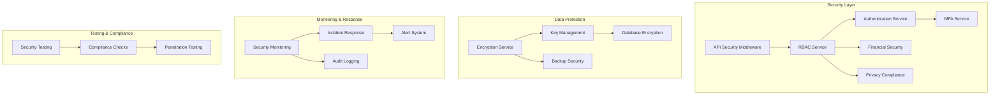

# Comprehensive Security & Access Control System Documentation

## Overview

This comprehensive security system provides enterprise-grade protection for the multi-tier reporting and analytics platform, covering financial, operational, and customer intelligence data with advanced security controls, monitoring, and compliance features.

## System Architecture



## Core Security Components

### 1. Enhanced Role-Based Access Control (RBAC)

**Features:**
- Hierarchical role inheritance
- Granular permission system
- Dynamic role assignment
- Scope-based access control
- Separation of duties enforcement

**Key Files:**
- `app/Services/Security/RBACService.php` - Core RBAC logic
- `app/Models/Security/SecurityRole.php` - Role management
- `app/Models/Security/SecurityPermission.php` - Permission definitions
- `app/Models/Security/SecurityUserRole.php` - User-role assignments

**Usage Example:**
```php
// Check user permission
if ($rbacService->hasPermission($user, 'financial_reports.view')) {
    // Allow access
}

// Assign role to user
$rbacService->assignRole($user, $roleId, ['scope' => 'branch_1']);
```

### 2. Multi-Factor Authentication (MFA)

**Features:**
- TOTP-based authentication
- SMS and email verification
- Backup codes
- Device registration
- Progressive authentication

**Key Files:**
- `app/Services/Security/MfaService.php` - MFA logic
- `app/Models/Security/SecurityMfaDevice.php` - Device management
- `database/migrations/2025_11_06_240000_create_security_mfa_devices_table.php` - MFA schema

**Usage Example:**
```php
// Generate TOTP secret
$secret = $mfaService->generateTotpSecret();

// Verify TOTP code
$isValid = $mfaService->verifyTotpCode($secret, $userCode);

// Register new device
$device = $mfaService->registerDevice($user, 'iPhone', 'totp', $secret);
```

### 3. Data Encryption & Key Management

**Features:**
- AES-256-GCM encryption
- Master/data key separation
- Key rotation
- Financial data encryption
- Secure key storage

**Key Files:**
- `app/Services/Security/EncryptionService.php` - Core encryption
- `app/Models/Security/SecurityEncryptionKey.php` - Key management
- `database/migrations/2025_11_06_220000_create_security_encryption_keys_table.php` - Key schema

**Usage Example:**
```php
// Encrypt sensitive data
$encrypted = $encryptionService->encryptData($sensitiveData, 'financial');

// Decrypt data
$decrypted = $encryptionService->decryptData($encrypted, 'financial');

// Encrypt financial data with extra security
$financialEncrypted = $encryptionService->encryptFinancialData($financialData);
```

### 4. Advanced API Security

**Features:**
- Rate limiting (100/min, 1000/hour)
- SQL injection protection
- XSS prevention
- Input validation
- Suspicious pattern detection
- Security headers

**Key Files:**
- `app/Http/Middleware/EnhancedApiSecurityMiddleware.php` - API security middleware

**Usage Example:**
```php
// Apply to routes
Route::middleware(['enhanced.api.security:permission_required'])->group(function () {
    Route::get('/sensitive-data', [Controller::class, 'getData']);
});
```

### 5. Financial Data Security

**Features:**
- Segregation of duties
- Approval workflows
- Financial audit trails
- SOX compliance
- Transaction limits
- Risk-based controls

**Key Files:**
- `app/Services/Security/FinancialSecurityService.php` - Financial security
- Comprehensive audit logging for all financial operations

**Usage Example:**
```php
// Create financial transaction with security controls
$result = $financialService->createFinancialTransaction($user, [
    'amount' => 1500,
    'type' => 'payment',
    'description' => 'Vendor payment'
]);
```

### 6. Privacy Compliance (GDPR/CCPA)

**Features:**
- Consent management
- Right to be forgotten
- Data portability
- Data retention policies
- Privacy audit trails
- Consent withdrawal

**Key Files:**
- `app/Services/Security/PrivacyComplianceService.php` - Privacy compliance
- `app/Models/Security/SecurityPrivacyConsent.php` - Consent management
- `database/migrations/2025_11_06_240100_create_security_privacy_consents_table.php` - Consent schema

**Usage Example:**
```php
// Record consent
$consent = $privacyService->recordConsent($user, 'marketing', true);

// Handle right to be forgotten
$result = $privacyService->handleRightToBeForgotten($user, [
    'anonymize' => true,
    'retain' => true
]);
```

### 7. Security Monitoring & Incident Response

**Features:**
- Real-time threat detection
- Automated incident response
- Security metrics dashboard
- Threat intelligence
- Incident escalation
- Recovery workflows

**Key Files:**
- `app/Services/Security/SecurityMonitoringService.php` - Monitoring system
- `app/Models/Security/SecurityIncident.php` - Incident management

**Usage Example:**
```php
// Monitor for threats
$threats = $monitoringService->monitorSecurityThreats();

// Create security incident
$incident = $monitoringService->createSecurityIncident([
    'title' => 'Multiple failed login attempts',
    'severity' => 'high',
    'type' => 'authentication'
]);
```

### 8. Backup Security & Recovery

**Features:**
- Encrypted backups
- Automated scheduling
- Integrity verification
- Secure recovery
- Retention policies
- Off-site storage support

**Key Files:**
- `app/Services/Security/BackupSecurityService.php` - Backup operations

**Usage Example:**
```php
// Create secure backup
$backup = $backupService->createSecureBackup('full', [
    'include_paths' => ['app', 'database', 'config'],
    'exclude_patterns' => ['logs', 'cache']
]);

// Restore from backup
$result = $backupService->restoreFromBackup($backupId, [
    'create_safety_backup' => true
]);
```

### 9. Security Testing Framework

**Features:**
- Comprehensive test suite
- Authentication testing
- Authorization validation
- Encryption testing
- API security testing
- Compliance validation

**Key Files:**
- `app/Services/Security/SecurityTestingService.php` - Testing framework

**Usage Example:**
```php
// Run comprehensive security tests
$results = $testingService->runComprehensiveSecurityTest();

// Check results
echo "Tests passed: {$results['summary']['passed']}/{$results['summary']['total_tests']}";
```

## Database Schema

### Security Tables Structure

1. **security_roles** - Role definitions and hierarchy
2. **security_permissions** - Permission system
3. **security_role_permissions** - Role-permission mappings
4. **security_user_roles** - User-role assignments
5. **security_audit_logs** - Comprehensive audit trail
6. **security_encryption_keys** - Key management
7. **security_mfa_devices** - MFA device registration
8. **security_privacy_consents** - GDPR/CCPA consent management
9. **security_incidents** - Incident management
10. **security_incident_timeline** - Incident tracking

## Implementation Guide

### 1. Installation

```bash
# Run migrations
php artisan migrate

# Clear cache
php artisan cache:clear
php artisan config:clear
php artisan route:clear
```

### 2. Configuration

**Environment Variables (.env):**
```env
# Security Configuration
SECURITY_MFA_ENABLED=true
SECURITY_ENCRYPTION_ENABLED=true
SECURITY_AUDIT_ENABLED=true
SECURITY_MONITORING_ENABLED=true

# Database Encryption
DB_ENCRYPTION_ENABLED=true
DB_KEY_ROTATION_DAYS=365

# API Security
API_RATE_LIMIT_PER_MINUTE=100
API_RATE_LIMIT_PER_HOUR=1000

# Privacy Compliance
GDPR_ENABLED=true
CCPA_ENABLED=true
DATA_RETENTION_DAYS=2555
```

### 3. Service Registration

The security services are automatically registered in the Laravel service container. All services can be resolved through dependency injection.

### 4. Middleware Configuration

Add to `app/Http/Kernel.php`:
```php
protected $routeMiddleware = [
    // ... existing middleware
    'enhanced.api.security' => \App\Http\Middleware\EnhancedApiSecurityMiddleware::class,
];
```

## Security Best Practices

### 1. Authentication
- Use MFA for all administrative accounts
- Implement strong password policies
- Enable session timeout
- Use secure session storage

### 2. Authorization
- Apply principle of least privilege
- Regular access reviews
- Implement role-based access control
- Monitor privilege escalation

### 3. Data Protection
- Encrypt sensitive data at rest
- Use TLS 1.3 for data in transit
- Implement data classification
- Regular key rotation

### 4. Monitoring
- Real-time security monitoring
- Regular security assessments
- Incident response procedures
- Compliance reporting

### 5. Privacy
- Implement privacy by design
- Regular consent reviews
- Data minimization principles
- Right to be forgotten processes

## Compliance Features

### SOX Compliance
- Segregation of duties enforcement
- Financial audit trails
- Access controls for financial systems
- Transaction approval workflows

### GDPR Compliance
- Consent management system
- Right to be forgotten functionality
- Data portability features
- Privacy audit trails
- Data retention policies

### CCPA Compliance
- Consumer rights management
- Data transparency features
- Opt-out mechanisms
- Data disclosure controls

## Security Operations

### Daily Operations
- Monitor security alerts
- Review audit logs
- Check system integrity
- Validate backup procedures

### Weekly Operations
- Review access patterns
- Update security policies
- Test incident response
- Security metrics review

### Monthly Operations
- Security assessments
- User access reviews
- Policy updates
- Compliance reporting

### Quarterly Operations
- Security audits
- Penetration testing
- Policy reviews
- Training updates

## API Reference

### RBAC Service
```php
$rbacService->hasPermission($user, $permission);
$rbacService->assignRole($user, $roleId, $scopeRestrictions);
$rbacService->revokeRole($user, $roleId);
$rbacService->createRole($roleData);
$rbacService->createPermission($permissionData);
```

### MFA Service
```php
$mfaService->generateTotpSecret();
$mfaService->verifyTotpCode($secret, $code);
$mfaService->sendSmsCode($user, $phone);
$mfaService->registerDevice($user, $name, $type, $identifier);
```

### Encryption Service
```php
$encryptionService->encryptData($data, $context);
$encryptionService->decryptData($encryptedData, $context);
$encryptionService->encryptFinancialData($data);
$encryptionService->rotateKeys();
```

### Financial Security Service
```php
$financialService->createFinancialTransaction($user, $data);
$financialService->approveTransaction($approver, $transactionId);
$financialService->getFinancialSecurityMetrics($period);
```

### Privacy Compliance Service
```php
$privacyService->recordConsent($user, $type, $given, $metadata);
$privacyService->handleRightToBeForgotten($user, $options);
$privacyService->handleDataExportRequest($user, $dataTypes);
$privacyService->withdrawConsent($user, $type, $method);
```

### Security Monitoring Service
```php
$monitoringService->monitorSecurityThreats();
$monitoringService->createSecurityIncident($incidentData);
$monitoringService->getSecurityMetrics($period);
```

### Backup Security Service
```php
$backupService->createSecureBackup($type, $options);
$backupService->restoreFromBackup($backupId, $options);
$backupService->verifyBackupIntegrity($backupPath);
$backupService->cleanupOldBackups();
```

## Troubleshooting

### Common Issues

1. **MFA not working**
   - Check device registration
   - Verify time synchronization
   - Check backup codes

2. **Encryption errors**
   - Verify key management
   - Check key rotation
   - Validate key storage

3. **Permission issues**
   - Review role assignments
   - Check permission mappings
   - Verify scope restrictions

4. **Monitoring alerts**
   - Review threat patterns
   - Check incident status
   - Validate alert thresholds

### Log Locations
- Security logs: `storage/logs/security.log`
- Audit logs: Database `security_audit_logs` table
- Financial logs: `storage/logs/financial.log`
- Privacy logs: `storage/logs/privacy.log`
- Backup logs: `storage/logs/backup.log`

## Support and Maintenance

### Regular Maintenance Tasks
1. **Daily**: Monitor security alerts and incidents
2. **Weekly**: Review access patterns and permissions
3. **Monthly**: Update security policies and procedures
4. **Quarterly**: Conduct security assessments and audits

### Emergency Procedures
1. **Security Incident**: Follow incident response workflow
2. **Data Breach**: Execute breach response plan
3. **System Compromise**: Implement containment procedures
4. **Key Compromise**: Execute key rotation procedures

## Security Incident Response

### Incident Classification
- **Critical**: Immediate response required
- **High**: Response within 4 hours
- **Medium**: Response within 24 hours
- **Low**: Response within 72 hours

### Response Workflow
1. **Detection**: Automated or manual detection
2. **Assessment**: Determine impact and scope
3. **Containment**: Isolate affected systems
4. **Investigation**: Analyze root cause
5. **Recovery**: Restore normal operations
6. **Lessons Learned**: Update procedures

## Conclusion

This comprehensive security system provides enterprise-grade protection for sensitive data while maintaining regulatory compliance and operational efficiency. The modular design allows for easy customization and scaling to meet specific organizational requirements.

For additional support or customization requests, please refer to the technical documentation or contact the security team.