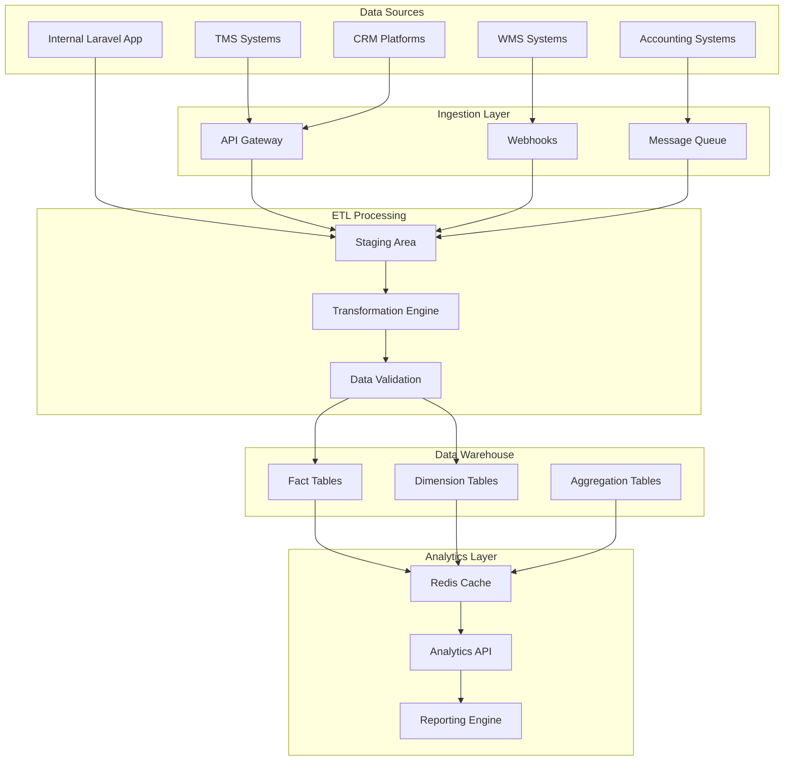
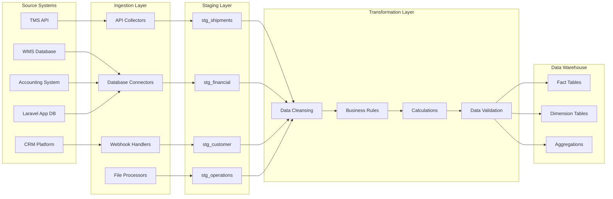

# Multi-Tier Analytics Platform Architecture

## Executive Summary

This document outlines the comprehensive database schema and ETL pipeline architecture for a multi-tier reporting and analytics platform designed to handle 500K+ daily records from mixed internal/external systems with sub-second query performance.

## System Architecture Overview



## 1. Star Schema Data Warehouse Design

### 1.1 Core Fact Tables

#### FactShipments
**Purpose**: Central fact table tracking all shipment lifecycle events
**Grain**: One record per shipment per status change
**Partitioning**: Monthly partitions by `created_date`
**Retention**: 7 years

```sql
CREATE TABLE fact_shipments (
    shipment_key BIGINT PRIMARY KEY AUTO_INCREMENT,
    shipment_id BIGINT NOT NULL,
    tracking_number VARCHAR(50) NOT NULL,
    client_key BIGINT NOT NULL,
    origin_branch_key BIGINT NOT NULL,
    dest_branch_key BIGINT NOT NULL,
    carrier_key BIGINT,
    driver_key BIGINT,
    customer_key BIGINT NOT NULL,
    
    -- Delivery metrics
    pickup_date_key INT,
    delivery_date_key INT,
    scheduled_delivery_date_key INT,
    actual_delivery_duration_minutes INT,
    scheduled_delivery_duration_minutes INT,
    
    -- Financial metrics  
    declared_value DECIMAL(12,2),
    shipping_charge DECIMAL(10,2),
    cod_amount DECIMAL(10,2),
    fuel_surcharge DECIMAL(10,2),
    insurance_cost DECIMAL(8,2),
    total_cost DECIMAL(10,2),
    revenue DECIMAL(10,2),
    margin DECIMAL(10,2),
    margin_percentage DECIMAL(5,2),
    
    -- Operational metrics
    weight_kg DECIMAL(8,3),
    distance_km DECIMAL(8,2),
    delivery_attempts INT DEFAULT 0,
    exception_flag TINYINT(1) DEFAULT 0,
    returned_flag TINYINT(1) DEFAULT 0,
    
    -- Time dimensions
    created_date_key INT NOT NULL,
    created_timestamp TIMESTAMP DEFAULT CURRENT_TIMESTAMP,
    updated_timestamp TIMESTAMP DEFAULT CURRENT_TIMESTAMP ON UPDATE CURRENT_TIMESTAMP,
    
    -- ETL metadata
    etl_batch_id VARCHAR(50),
    source_system VARCHAR(50),
    data_quality_score DECIMAL(3,2),
    
    INDEX idx_client_status (client_key, status),
    INDEX idx_dates (pickup_date_key, delivery_date_key),
    INDEX idx_branch_route (origin_branch_key, dest_branch_key),
    INDEX idx_performance (margin_percentage, delivery_attempts)
) ENGINE=InnoDB PARTITION BY RANGE (created_date_key) (
    PARTITION p2024_01 VALUES LESS THAN (20240201),
    PARTITION p2024_02 VALUES LESS THAN (20240301),
    -- Additional partitions...
);
```

#### FactFinancialTransactions
**Purpose**: Track all financial transactions and revenue recognition
**Grain**: One record per financial event
**Partitioning**: Monthly partitions by `transaction_date_key`

```sql
CREATE TABLE fact_financial_transactions (
    transaction_key BIGINT PRIMARY KEY AUTO_INCREMENT,
    transaction_id VARCHAR(50) NOT NULL UNIQUE,
    shipment_key BIGINT,
    client_key BIGINT,
    customer_key BIGINT,
    branch_key BIGINT,
    
    -- Transaction details
    transaction_type_key INT NOT NULL,
    transaction_category_key INT NOT NULL,
    account_key BIGINT,
    
    -- Financial amounts
    debit_amount DECIMAL(12,2) DEFAULT 0.00,
    credit_amount DECIMAL(12,2) DEFAULT 0.00,
    running_balance DECIMAL(12,2),
    
    -- Time dimensions
    transaction_date_key INT NOT NULL,
    transaction_timestamp TIMESTAMP DEFAULT CURRENT_TIMESTAMP,
    
    -- Reference data
    reference_number VARCHAR(100),
    description TEXT,
    status VARCHAR(20) DEFAULT 'POSTED',
    
    -- ETL metadata
    etl_batch_id VARCHAR(50),
    source_system VARCHAR(50),
    
    INDEX idx_client_date (client_key, transaction_date_key),
    INDEX idx_account_balance (account_key, transaction_date_key),
    INDEX idx_shipment (shipment_key),
    INDEX idx_type_category (transaction_type_key, transaction_category_key)
) ENGINE=InnoDB;
```

#### FactPerformanceMetrics
**Purpose**: Aggregate performance KPIs for operational analytics
**Grain**: One record per branch per day
**Partitioning**: Monthly partitions by `date_key`

```sql
CREATE TABLE fact_performance_metrics (
    metric_key BIGINT PRIMARY KEY AUTO_INCREMENT,
    branch_key BIGINT NOT NULL,
    date_key INT NOT NULL,
    
    -- Volume metrics
    total_shipments INT DEFAULT 0,
    delivered_shipments INT DEFAULT 0,
    returned_shipments INT DEFAULT 0,
    exception_shipments INT DEFAULT 0,
    
    -- Performance metrics
    on_time_delivery_rate DECIMAL(5,2),
    first_attempt_success_rate DECIMAL(5,2),
    average_delivery_time_hours DECIMAL(8,2),
    
    -- Financial metrics
    total_revenue DECIMAL(12,2) DEFAULT 0.00,
    total_cost DECIMAL(12,2) DEFAULT 0.00,
    total_margin DECIMAL(12,2) DEFAULT 0.00,
    margin_percentage DECIMAL(5,2),
    
    -- Customer metrics
    customer_complaints INT DEFAULT 0,
    customer_satisfaction_score DECIMAL(3,2),
    
    INDEX idx_branch_date (branch_key, date_key),
    INDEX idx_performance (on_time_delivery_rate, margin_percentage)
) ENGINE=InnoDB;
```

### 1.2 Core Dimension Tables

#### DimClient
```sql
CREATE TABLE dim_client (
    client_key BIGINT PRIMARY KEY AUTO_INCREMENT,
    client_id BIGINT NOT NULL,
    client_code VARCHAR(20) UNIQUE NOT NULL,
    business_name VARCHAR(200) NOT NULL,
    industry VARCHAR(100),
    client_tier ENUM('ENTERPRISE', 'STANDARD', 'BASIC') DEFAULT 'STANDARD',
    contract_start_date DATE,
    contract_end_date DATE,
    
    -- Contact information
    primary_contact_name VARCHAR(100),
    primary_contact_email VARCHAR(100),
    primary_contact_phone VARCHAR(20),
    
    -- Service level
    service_level_agreement VARCHAR(50),
    priority_level TINYINT DEFAULT 3,
    
    -- Financial terms
    credit_limit DECIMAL(12,2) DEFAULT 0.00,
    payment_terms_days TINYINT DEFAULT 30,
    
    -- Status tracking
    is_active TINYINT(1) DEFAULT 1,
    effective_date DATE DEFAULT (CURRENT_DATE),
    expiration_date DATE DEFAULT '9999-12-31',
    
    -- ETL metadata
    etl_batch_id VARCHAR(50),
    source_system VARCHAR(50),
    last_updated_timestamp TIMESTAMP DEFAULT CURRENT_TIMESTAMP ON UPDATE CURRENT_TIMESTAMP,
    
    INDEX idx_client_code (client_code),
    INDEX idx_tier_sla (client_tier, service_level_agreement)
) ENGINE=InnoDB;
```

#### DimBranch
```sql
CREATE TABLE dim_branch (
    branch_key BIGINT PRIMARY KEY AUTO_INCREMENT,
    branch_id BIGINT NOT NULL,
    branch_code VARCHAR(20) UNIQUE NOT NULL,
    branch_name VARCHAR(200) NOT NULL,
    branch_type ENUM('HUB', 'REGIONAL', 'LOCAL') DEFAULT 'LOCAL',
    is_hub TINYINT(1) DEFAULT 0,
    parent_branch_key BIGINT,
    
    -- Location details
    address TEXT,
    city VARCHAR(100),
    state_province VARCHAR(100),
    postal_code VARCHAR(20),
    country VARCHAR(100),
    latitude DECIMAL(10, 8),
    longitude DECIMAL(11, 8),
    
    -- Contact information
    phone VARCHAR(20),
    email VARCHAR(100),
    manager_name VARCHAR(100),
    
    -- Operational details
    capacity_shipments_per_day INT DEFAULT 1000,
    operating_hours JSON,
    service_capabilities JSON,
    
    -- Performance targets
    on_time_delivery_target DECIMAL(5,2) DEFAULT 95.00,
    customer_satisfaction_target DECIMAL(3,2) DEFAULT 4.50,
    
    -- Status tracking
    is_active TINYINT(1) DEFAULT 1,
    effective_date DATE DEFAULT (CURRENT_DATE),
    expiration_date DATE DEFAULT '9999-12-31',
    
    INDEX idx_branch_type (branch_type),
    INDEX idx_location (latitude, longitude),
    INDEX idx_active_hubs (is_hub, is_active)
) ENGINE=InnoDB;
```

#### DimCustomer
```sql
CREATE TABLE dim_customer (
    customer_key BIGINT PRIMARY KEY AUTO_INCREMENT,
    customer_id BIGINT NOT NULL,
    customer_code VARCHAR(20) UNIQUE,
    first_name VARCHAR(100),
    last_name VARCHAR(100),
    full_name VARCHAR(200),
    email VARCHAR(100),
    phone VARCHAR(20),
    
    -- Address information
    street_address TEXT,
    city VARCHAR(100),
    state_province VARCHAR(100),
    postal_code VARCHAR(20),
    country VARCHAR(100),
    latitude DECIMAL(10, 8),
    longitude DECIMAL(11, 8),
    
    -- Customer segmentation
    customer_tier ENUM('VIP', 'PREMIUM', 'STANDARD', 'BASIC') DEFAULT 'STANDARD',
    acquisition_channel VARCHAR(50),
    customer_since_date DATE,
    
    -- Behavioral metrics
    total_shipments INT DEFAULT 0,
    total_spend DECIMAL(12,2) DEFAULT 0.00,
    average_order_value DECIMAL(10,2) DEFAULT 0.00,
    last_shipment_date DATE,
    
    -- Preferences
    preferred_delivery_time VARCHAR(50),
    notification_preferences JSON,
    
    -- Status tracking
    is_active TINYINT(1) DEFAULT 1,
    effective_date DATE DEFAULT (CURRENT_DATE),
    expiration_date DATE DEFAULT '9999-12-31',
    
    INDEX idx_customer_tier (customer_tier),
    INDEX idx_location (latitude, longitude),
    INDEX idx_spend (total_spend, average_order_value)
) ENGINE=InnoDB;
```

#### DimTime
```sql
CREATE TABLE dim_time (
    date_key INT PRIMARY KEY,
    full_date DATE NOT NULL,
    day_of_week TINYINT,
    day_name VARCHAR(10),
    day_of_month TINYINT,
    day_of_year SMALLINT,
    week_of_year TINYINT,
    month_number TINYINT,
    month_name VARCHAR(10),
    quarter_number TINYINT,
    quarter_name VARCHAR(10),
    year_number SMALLINT,
    is_weekend TINYINT(1),
    is_holiday TINYINT(1),
    fiscal_year SMALLINT,
    fiscal_quarter TINYINT,
    
    INDEX idx_year_quarter (year_number, quarter_number),
    INDEX idx_month (month_number, year_number)
) ENGINE=InnoDB;
```

### 1.3 Supporting Dimension Tables

#### DimCarrier
```sql
CREATE TABLE dim_carrier (
    carrier_key BIGINT PRIMARY KEY AUTO_INCREMENT,
    carrier_id BIGINT NOT NULL,
    carrier_code VARCHAR(20) UNIQUE NOT NULL,
    carrier_name VARCHAR(200) NOT NULL,
    carrier_type ENUM('INTERNAL', 'EXTERNAL_PARTNER', 'THIRD_PARTY') DEFAULT 'INTERNAL',
    service_modes JSON, -- ['air', 'road', 'sea']
    
    -- Performance metrics
    on_time_performance DECIMAL(5,2),
    cost_per_km DECIMAL(8,4),
    capacity_utilization DECIMAL(5,2),
    
    -- Contract terms
    contract_rate DECIMAL(8,4),
    fuel_surcharge_rate DECIMAL(5,4),
    minimum_charge DECIMAL(8,2),
    
    -- Status
    is_active TINYINT(1) DEFAULT 1,
    effective_date DATE DEFAULT (CURRENT_DATE),
    expiration_date DATE DEFAULT '9999-12-31',
    
    INDEX idx_carrier_type (carrier_type),
    INDEX idx_performance (on_time_performance, cost_per_km)
) ENGINE=InnoDB;
```

#### DimDriver
```sql
CREATE TABLE dim_driver (
    driver_key BIGINT PRIMARY KEY AUTO_INCREMENT,
    driver_id BIGINT NOT NULL,
    employee_id VARCHAR(20),
    first_name VARCHAR(100),
    last_name VARCHAR(100),
    full_name VARCHAR(200),
    license_number VARCHAR(50),
    license_expiry_date DATE,
    
    -- Performance metrics
    total_deliveries INT DEFAULT 0,
    on_time_delivery_rate DECIMAL(5,2),
    customer_rating DECIMAL(3,2),
    accident_count INT DEFAULT 0,
    
    -- Route information
    primary_branch_key BIGINT,
    service_areas JSON,
    
    -- Employment details
    hire_date DATE,
    employment_status ENUM('ACTIVE', 'INACTIVE', 'TERMINATED') DEFAULT 'ACTIVE',
    
    INDEX idx_performance (on_time_delivery_rate, customer_rating),
    INDEX idx_branch (primary_branch_key)
) ENGINE=InnoDB;
```

## 2. ETL Pipeline Architecture

### 2.1 Data Flow Overview



### 2.2 ETL Configuration Structure

```php
<?php
// config/etl-pipeline.php

return [
    'pipelines' => [
        'shipments' => [
            'name' => 'Shipments Processing Pipeline',
            'schedule' => 'every_5_minutes',
            'sources' => [
                'tms_api' => [
                    'type' => 'api',
                    'endpoint' => env('TMS_API_ENDPOINT'),
                    'auth' => 'bearer_token',
                    'incremental_field' => 'updated_at',
                    'batch_size' => 1000,
                ],
                'internal_db' => [
                    'type' => 'database',
                    'table' => 'shipments',
                    'connection' => 'mysql',
                    'incremental_field' => 'updated_at',
                ],
            ],
            'transformations' => [
                'data_cleansing' => [
                    'trim_fields' => ['tracking_number', 'customer_name'],
                    'standardize_status' => 'App\\Transformers\\StatusTransformer',
                    'validate_coordinates' => true,
                ],
                'business_rules' => [
                    'calculate_delivery_time' => 'App\\Transformers\\DeliveryTimeCalculator',
                    'enrich_with_branch_data' => 'App\\Transformers\\BranchEnricher',
                ],
                'data_validation' => [
                    'required_fields' => ['tracking_number', 'client_id', 'origin_branch_id'],
                    'data_types' => [
                        'declared_value' => 'decimal',
                        'weight_kg' => 'decimal',
                    ],
                ],
            ],
            'destinations' => [
                'staging' => [
                    'table' => 'stg_shipments',
                    'load_type' => 'upsert',
                    'merge_key' => 'shipment_id',
                ],
            ],
        ],
        'financial' => [
            'name' => 'Financial Transactions Pipeline',
            'schedule' => 'every_10_minutes',
            'sources' => [
                'accounting_system' => [
                    'type' => 'database',
                    'table' => 'financial_transactions',
                    'connection' => 'accounting_db',
                ],
            ],
            'destinations' => [
                'fact_financial_transactions' => [
                    'load_type' => 'append',
                ],
            ],
        ],
    ],
    'quality_checks' => [
        'shipment_delivery_time' => [
            'rule' => 'delivery_time > 0 AND delivery_time < 168', // Max 7 days
            'severity' => 'ERROR',
            'action' => 'reject_record',
        ],
        'financial_balance' => [
            'rule' => 'ABS(debit_amount - credit_amount) > 0.01',
            'severity' => 'WARNING',
            'action' => 'flag_for_review',
        ],
    ],
    'performance' => [
        'batch_size' => 5000,
        'max_concurrent_jobs' => 10,
        'memory_limit' => '2G',
        'timeout' => 3600,
    ],
];
```

### 2.3 ETL Job Implementation

```php
<?php
// app/Services/ETL/ShipmentsETLJob.php

namespace App\Services\ETL;

use Illuminate\\Bus\\Queueable;
use Illuminate\\Contracts\\Queue\\ShouldQueue;
use Illuminate\\Foundation\\Bus\\Dispatchable;
use Illuminate\\Queue\\InteractsWithQueue;
use Illuminate\\Queue\\SerializesModels;
use App\\Models\\ETL\\EtlBatch;
use App\\Services\\ETL\\Transformers\\DataTransformer;
use App\\Services\\ETL\\Validators\\DataValidator;
use App\\Services\\Cache\\CacheService;

class ShipmentsETLJob implements ShouldQueue
{
    use Dispatchable, InteractsWithQueue, Queueable, SerializesModels;

    public $timeout = 3600;
    public $tries = 3;
    public $backoff = [60, 300, 900];

    protected $batchId;
    protected $sourceConfig;

    public function __construct(string $batchId, array $sourceConfig)
    {
        $this->batchId = $batchId;
        $this->sourceConfig = $sourceConfig;
    }

    public function handle(): void
    {
        $batch = EtlBatch::findOrFail($this->batchId);
        
        try {
            $batch->updateStatus('RUNNING');
            
            // 1. Extract data from sources
            $extractedData = $this->extract();
            
            // 2. Load to staging
            $stagingData = $this->loadToStaging($extractedData);
            
            // 3. Transform data
            $transformedData = $this->transform($stagingData);
            
            // 4. Validate data
            $validatedData = $this->validate($transformedData);
            
            // 5. Load to data warehouse
            $this->loadToWarehouse($validatedData);
            
            // 6. Update aggregations
            $this->updateAggregations();
            
            // 7. Clear relevant caches
            $this->clearCaches();
            
            $batch->updateStatus('COMPLETED');
            
        } catch (\\Exception $e) {
            $batch->updateStatus('FAILED', $e->getMessage());
            throw $e;
        }
    }

    protected function extract(): array
    {
        $data = [];
        
        foreach ($this->sourceConfig as $sourceName => $config) {
            switch ($config['type']) {
                case 'api':
                    $data[$sourceName] = $this->extractFromApi($config);
                    break;
                case 'database':
                    $data[$sourceName] = $this->extractFromDatabase($config);
                    break;
            }
        }
        
        return $data;
    }

    protected function extractFromApi(array $config): array
    {
        $client = new \\GuzzleHttp\\Client();
        $lastUpdate = $this->getLastExtractionTimestamp($config['table'] ?? $config['endpoint']);
        
        $response = $client->get($config['endpoint'], [
            'headers' => ['Authorization' => 'Bearer ' . $config['token']],
            'query' => [
                'updated_since' => $lastUpdate,
                'limit' => $config['batch_size'] ?? 1000,
            ]
        ]);
        
        return json_decode($response->getBody(), true);
    }

    protected function extractFromDatabase(array $config): array
    {
        $lastUpdate = $this->getLastExtractionTimestamp($config['table']);
        
        return \\DB::connection($config['connection'] ?? 'mysql')
            ->table($config['table'])
            ->where($config['incremental_field'], '>', $lastUpdate)
            ->limit($config['batch_size'] ?? 1000)
            ->get()
            ->toArray();
    }

    protected function loadToStaging(array $data): array
    {
        $stagingTable = 'stg_' . ($this->sourceConfig['table'] ?? 'shipments');
        
        foreach ($data as $sourceName => $records) {
            // Insert records to staging table
            foreach (array_chunk($records, 1000) as $chunk) {
                \\DB::table($stagingTable)->insert($chunk);
            }
        }
        
        return \\DB::table($stagingTable)->get()->toArray();
    }

    protected function transform(array $data): array
    {
        $transformer = new DataTransformer();
        return $transformer->transformShipments($data);
    }

    protected function validate(array $data): array
    {
        $validator = new DataValidator();
        return $validator->validateShipments($data);
    }

    protected function loadToWarehouse(array $data): void
    {
        // Load to fact and dimension tables
        $this->loadToFactTables($data);
        $this->loadToDimensionTables($data);
    }

    protected function updateAggregations(): void
    {
        // Update daily aggregations
        \\DB::statement('CALL sp_update_daily_aggregations()');
        
        // Update real-time metrics
        CacheService::forgetPattern('analytics:*');
    }

    protected function clearCaches(): void
    {
        CacheService::forgetPattern('dashboard:*');
        CacheService::forgetPattern('reports:*');
    }
}
```

## 3. Data Quality Framework

### 3.1 Data Quality Rules Engine

```php
<?php
// app/Services/DataQuality/DataQualityEngine.php

namespace App\\Services\\DataQuality;

class DataQualityEngine
{
    protected $rules = [
        'required_fields' => [
            'fact_shipments' => [
                'shipment_id', 'tracking_number', 'client_id', 'origin_branch_id', 
                'dest_branch_id', 'customer_id', 'created_date'
            ],
            'fact_financial_transactions' => [
                'transaction_id', 'transaction_type', 'amount', 'transaction_date'
            ]
        ],
        'data_type_validation' => [
            'declared_value' => 'decimal',
            'weight_kg' => 'decimal',
            'margin_percentage' => 'decimal',
            'delivery_attempts' => 'integer'
        ],
        'business_rule_validation' => [
            'delivery_time_positive' => 'delivery_duration_minutes > 0',
            'financial_balance' => 'ABS(debit_amount - credit_amount) < 0.01',
            'margin_within_range' => 'margin_percentage BETWEEN -100 AND 100',
        ],
        'referential_integrity' => [
            'client_exists' => 'client_key IN (SELECT client_key FROM dim_client)',
            'branch_exists' => 'origin_branch_key IN (SELECT branch_key FROM dim_branch)',
            'customer_exists' => 'customer_key IN (SELECT customer_key FROM dim_customer)',
        ]
    ];

    public function validateRecord(string $table, array $record): DataQualityResult
    {
        $result = new DataQualityResult();
        
        foreach ($this->rules as $ruleType => $rules) {
            foreach ($rules as $ruleName => $ruleDefinition) {
                $validationMethod = 'validate' . ucfirst($ruleName);
                if (method_exists($this, $validationMethod)) {
                    $ruleResult = $this->$validationMethod($table, $record, $ruleDefinition);
                    $result->addRuleResult($ruleName, $ruleResult);
                }
            }
        }
        
        return $result;
    }

    protected function validateRequiredFields(string $table, array $record, array $requiredFields): RuleResult
    {
        $missingFields = [];
        foreach ($requiredFields as $field) {
            if (!isset($record[$field]) || $record[$field] === null || $record[$field] === '') {
                $missingFields[] = $field;
            }
        }
        
        return new RuleResult(
            'required_fields',
            empty($missingFields),
            empty($missingFields) ? null : "Missing required fields: " . implode(', ', $missingFields)
        );
    }

    protected function validateDeliveryTimePositive(string $table, array $record, string $rule): RuleResult
    {
        $duration = $record['delivery_duration_minutes'] ?? null;
        $isValid = $duration > 0;
        
        return new RuleResult(
            'delivery_time_positive',
            $isValid,
            $isValid ? null : "Delivery duration must be positive, got: $duration"
        );
    }

    public function runAnomalyDetection(string $table, array $data): array
    {
        $anomalies = [];
        
        // Statistical anomaly detection
        $anomalies = array_merge($anomalies, $this->detectStatisticalAnomalies($data));
        
        // Business rule anomalies
        $anomalies = array_merge($anomalies, $this->detectBusinessRuleAnomalies($data));
        
        // Pattern-based anomalies
        $anomalies = array_merge($anomalies, $this->detectPatternAnomalies($data));
        
        return $anomalies;
    }

    protected function detectStatisticalAnomalies(array $data): array
    {
        $anomalies = [];
        $numericFields = ['declared_value', 'shipping_charge', 'delivery_duration_minutes'];
        
        foreach ($numericFields as $field) {
            $values = array_column($data, $field);
            $values = array_filter($values, function($v) { return $v !== null; });
            
            if (count($values) < 10) continue; // Need at least 10 values for anomaly detection
            
            $mean = array_sum($values) / count($values);
            $stdDev = $this->calculateStandardDeviation($values, $mean);
            
            foreach ($data as $index => $record) {
                if ($record[$field] === null) continue;
                
                $zScore = abs(($record[$field] - $mean) / $stdDev);
                if ($zScore > 3) { // 3-sigma rule
                    $anomalies[] = [
                        'type' => 'statistical',
                        'field' => $field,
                        'record_index' => $index,
                        'value' => $record[$field],
                        'expected_range' => [$mean - 3*$stdDev, $mean + 3*$stdDev],
                        'z_score' => $zScore,
                        'severity' => $zScore > 4 ? 'HIGH' : 'MEDIUM'
                    ];
                }
            }
        }
        
        return $anomalies;
    }

    protected function detectBusinessRuleAnomalies(array $data): array
    {
        $anomalies = [];
        
        // Detect impossible delivery times
        foreach ($data as $index => $record) {
            $duration = $record['delivery_duration_minutes'] ?? null;
            $distance = $record['distance_km'] ?? null;
            
            if ($duration && $distance && $duration < 5 && $distance > 100) {
                $anomalies[] = [
                    'type' => 'business_rule',
                    'rule' => 'delivery_time_distance_mismatch',
                    'record_index' => $index,
                    'description' => "Delivery time ($duration min) too short for distance ($distance km)",
                    'severity' => 'HIGH'
                ];
            }
        }
        
        // Detect unusual margin patterns
        foreach ($data as $index => $record) {
            $margin = $record['margin_percentage'] ?? null;
            $clientTier = $record['client_tier'] ?? null;
            
            if ($margin && $clientTier) {
                $expectedMargins = $this->getExpectedMarginsByClientTier($clientTier);
                if ($margin < $expectedMargins['min'] || $margin > $expectedMargins['max']) {
                    $anomalies[] = [
                        'type' => 'business_rule',
                        'rule' => 'margin_outside_expected_range',
                        'record_index' => $index,
                        'client_tier' => $clientTier,
                        'actual_margin' => $margin,
                        'expected_range' => $expectedMargins,
                        'severity' => 'MEDIUM'
                    ];
                }
            }
        }
        
        return $anomalies;
    }

    protected function calculateStandardDeviation(array $values, float $mean): float
    {
        $squaredDiffs = array_map(function($value) use ($mean) {
            return pow($value - $mean, 2);
        }, $values);
        
        $variance = array_sum($squaredDiffs) / count($values);
        return sqrt($variance);
    }

    protected function getExpectedMarginsByClientTier(string $tier): array
    {
        return [
            'ENTERPRISE' => ['min' => 15, 'max' => 35],
            'STANDARD' => ['min' => 25, 'max' => 50],
            'BASIC' => ['min' => 35, 'max' => 65],
        ];
    }
}
```

### 3.2 Audit Trail System

```sql
-- Audit trail table for tracking all data changes
CREATE TABLE etl_audit_log (
    audit_id BIGINT PRIMARY KEY AUTO_INCREMENT,
    table_name VARCHAR(100) NOT NULL,
    record_id BIGINT NOT NULL,
    operation ENUM('INSERT', 'UPDATE', 'DELETE') NOT NULL,
    change_type ENUM('MANUAL', 'ETL_BATCH', 'API_IMPORT', 'SYSTEM_UPDATE') NOT NULL,
    
    -- Before and after values
    before_values JSON,
    after_values JSON,
    changed_fields JSON,
    
    -- Context
    batch_id VARCHAR(50),
    source_system VARCHAR(50),
    user_id BIGINT,
    ip_address VARCHAR(45),
    user_agent TEXT,
    
    -- Quality metrics
    data_quality_score DECIMAL(3,2),
    validation_errors JSON,
    anomaly_flags JSON,
    
    created_at TIMESTAMP DEFAULT CURRENT_TIMESTAMP,
    
    INDEX idx_table_record (table_name, record_id),
    INDEX idx_batch (batch_id),
    INDEX idx_operation (operation, created_at)
) ENGINE=InnoDB;

-- Data lineage tracking
CREATE TABLE etl_data_lineage (
    lineage_id BIGINT PRIMARY KEY AUTO_INCREMENT,
    source_table VARCHAR(100) NOT NULL,
    source_record_id BIGINT NOT NULL,
    target_table VARCHAR(100) NOT NULL,
    target_record_id BIGINT NOT NULL,
    transformation_rules JSON,
    batch_id VARCHAR(50) NOT NULL,
    created_at TIMESTAMP DEFAULT CURRENT_TIMESTAMP,
    
    INDEX idx_source (source_table, source_record_id),
    INDEX idx_target (target_table, target_record_id),
    INDEX idx_batch (batch_id)
) ENGINE=InnoDB;
```

## 4. Performance Optimization Strategy

### 4.1 Indexing Strategy

```sql
-- Primary indexes for fact tables
CREATE INDEX idx_fact_shipments_composite ON fact_shipments (
    client_key, pickup_date_key, delivery_date_key, status
);

CREATE INDEX idx_fact_shipments_performance ON fact_shipments (
    origin_branch_key, dest_branch_key, carrier_key, margin_percentage
);

CREATE INDEX idx_fact_shipments_customer ON fact_shipments (
    customer_key, pickup_date_key, delivery_date_key
);

-- Covering indexes for common queries
CREATE INDEX idx_shipments_operational_cover ON fact_shipments (
    origin_branch_key, dest_branch_key, status, pickup_date_key
) INCLUDE (delivery_duration_minutes, total_cost, revenue, margin);

CREATE INDEX idx_shipments_financial_cover ON fact_shipments (
    client_key, delivery_date_key
) INCLUDE (revenue, total_cost, margin_percentage, cod_amount);

-- Dimension table indexes
CREATE INDEX idx_dim_client_tier ON dim_client (client_tier, is_active);
CREATE INDEX idx_dim_branch_location ON dim_branch (city, state_province, is_active);
CREATE INDEX idx_dim_customer_segment ON dim_customer (customer_tier, total_spend, average_order_value);

-- Aggregation table indexes
CREATE INDEX idx_fact_performance_branch_date ON fact_performance_metrics (
    branch_key, date_key, on_time_delivery_rate, margin_percentage
);
```

### 4.2 Partitioning Strategy

```sql
-- Monthly partitioning for fact tables
ALTER TABLE fact_shipments 
PARTITION BY RANGE (pickup_date_key) (
    PARTITION p2024_01 VALUES LESS THAN (20240201),
    PARTITION p2024_02 VALUES LESS THAN (20240301),
    PARTITION p2024_03 VALUES LESS THAN (20240401),
    PARTITION p2024_04 VALUES LESS THAN (20240501),
    PARTITION p2024_05 VALUES LESS THAN (20240601),
    PARTITION p2024_06 VALUES LESS THAN (20240701),
    PARTITION p2024_07 VALUES LESS THAN (20240801),
    PARTITION p2024_08 VALUES LESS THAN (20240901),
    PARTITION p2024_09 VALUES LESS THAN (20241001),
    PARTITION p2024_10 VALUES LESS THAN (20241101),
    PARTITION p2024_11 VALUES LESS THAN (20241201),
    PARTITION p2024_12 VALUES LESS THAN (20250101),
    PARTITION p_future VALUES LESS THAN MAXVALUE
);

-- Financial transactions by transaction date
ALTER TABLE fact_financial_transactions
PARTITION BY RANGE (transaction_date_key) (
    -- Similar monthly partitions
);
```

### 4.3 Caching Strategy

```php
<?php
// app/Services/Cache/AnalyticsCacheService.php

namespace App\\Services\\Cache;

class AnalyticsCacheService
{
    protected $cachePrefix = 'analytics:';
    protected $defaultTtl = 3600; // 1 hour
    
    public function getDashboardMetrics(string $branchId, string $dateRange): array
    {
        $cacheKey = $this->cachePrefix . "dashboard:{$branchId}:{$dateRange}";
        
        return \\Cache::remember($cacheKey, $this->defaultTtl, function() use ($branchId, $dateRange) {
            return $this->calculateDashboardMetrics($branchId, $dateRange);
        });
    }
    
    public function getShipmentPerformance(string $clientId, array $filters): array
    {
        $cacheKey = $this->cachePrefix . "performance:{$clientId}:" . md5(serialize($filters));
        
        return \\Cache::remember($cacheKey, 1800, function() use ($clientId, $filters) { // 30 min cache
            return $this->calculateShipmentPerformance($clientId, $filters);
        });
    }
    
    public function getFinancialReport(string $clientId, string $period): array
    {
        $cacheKey = $this->cachePrefix . "financial:{$clientId}:{$period}";
        
        return \\Cache::remember($cacheKey, 7200, function() use ($clientId, $period) { // 2 hour cache
            return $this->calculateFinancialReport($clientId, $period);
        });
    }
    
    public function invalidateBranchCache(string $branchId): void
    {
        \\Cache::tags(['branch_' . $branchId])->flush();
    }
    
    public function invalidateClientCache(string $clientId): void
    {
        \\Cache::tags(['client_' . $clientId])->flush();
    }
    
    protected function calculateDashboardMetrics(string $branchId, string $dateRange): array
    {
        return \\DB::select("
            SELECT 
                COUNT(*) as total_shipments,
                SUM(CASE WHEN status = 'delivered' THEN 1 ELSE 0 END) as delivered_shipments,
                SUM(CASE WHEN status = 'exception' THEN 1 ELSE 0 END) as exception_shipments,
                AVG(CASE WHEN status = 'delivered' THEN delivery_duration_minutes END) as avg_delivery_time,
                SUM(revenue) as total_revenue,
                SUM(total_cost) as total_cost,
                SUM(margin) as total_margin,
                AVG(margin_percentage) as avg_margin_percentage
            FROM fact_shipments fs
            JOIN dim_branch db ON fs.origin_branch_key = db.branch_key
            WHERE db.branch_id = ? 
            AND pickup_date_key BETWEEN ? AND ?
        ", [$branchId, $this->getDateRangeStart($dateRange), $this->getDateRangeEnd($dateRange)]);
    }
}
```

## 5. Implementation Plan

Based on the architecture above, here's the step-by-step implementation plan:

### Phase 1: Foundation Setup (Weeks 1-2)
- Create database schema migration files
- Set up staging tables and initial ETL infrastructure
- Implement basic data quality framework
- Create Redis caching layer

### Phase 2: Core ETL Development (Weeks 3-4) 
- Build ETL pipeline for shipments data
- Implement transformation and validation logic
- Create dimension table population processes
- Set up audit trail system

### Phase 3: Advanced Features (Weeks 5-6)
- Add financial transactions ETL pipeline
- Implement anomaly detection algorithms
- Create performance optimization (indexing, partitioning)
- Build reporting API endpoints

### Phase 4: Testing & Optimization (Weeks 7-8)
- Load testing with sample data
- Performance tuning and optimization
- Data quality validation
- Documentation and training materials

Would you like me to proceed with implementing any specific component of this architecture? I can start with the database migration files, ETL pipeline configuration, or any other aspect you'd like to focus on first.