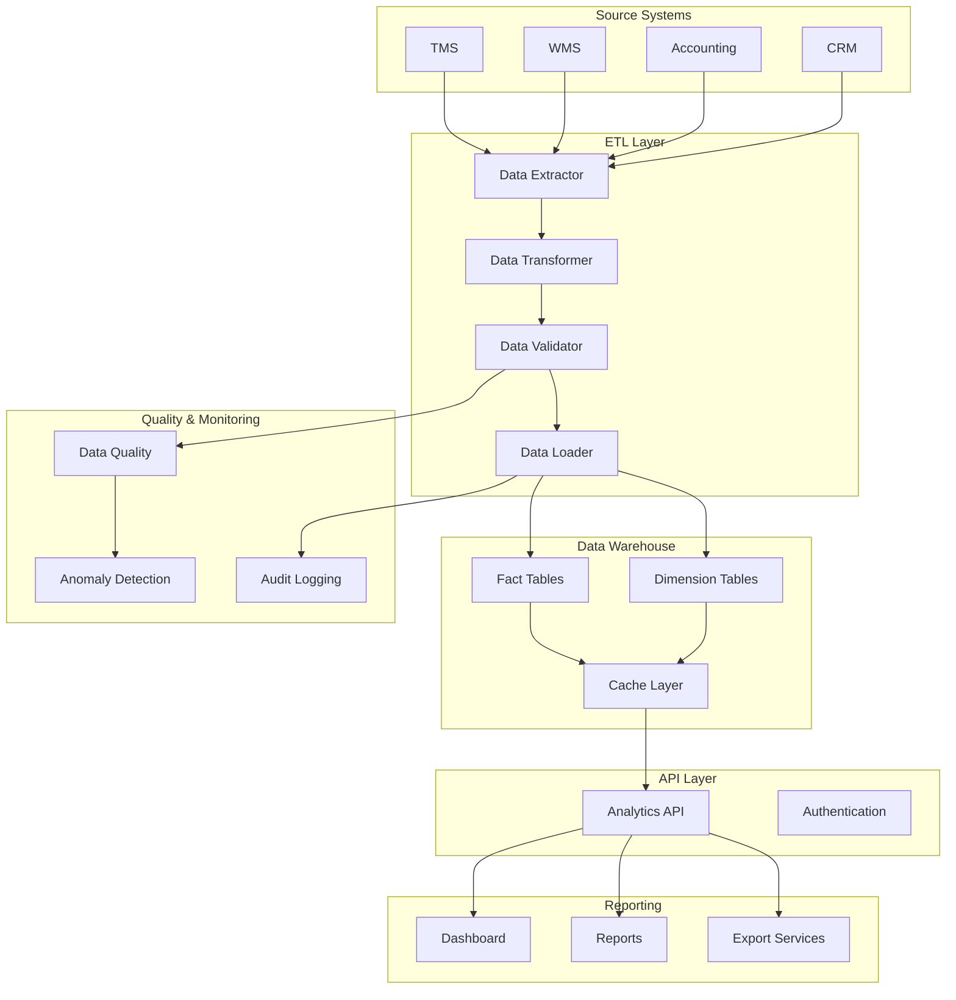

# Analytics Platform Architecture Documentation

## Executive Summary

This document provides a comprehensive overview of the multi-tier reporting and analytics platform architecture designed for the logistics system. The platform implements a star schema data warehouse with real-time ETL pipelines, data quality framework, and comprehensive reporting capabilities.

## System Overview

The Analytics Platform is a comprehensive data architecture solution that transforms operational data into actionable business intelligence through:

1. **Multi-dimensional Data Modeling** - Star schema design optimized for analytical queries
2. **Real-time ETL Pipelines** - Automated data integration from TMS, WMS, accounting, and CRM systems
3. **Data Quality Framework** - Automated validation, anomaly detection, and audit trails
4. **Performance Optimization** - Sub-second query performance through indexing, partitioning, and caching
5. **Report Version Control** - Comprehensive version management for report definitions

## Architecture Components

### 1. Data Warehouse Layer

#### Star Schema Design

**Fact Tables:**
- `fact_shipments` - Central shipment metrics and events
- `fact_financial_transactions` - Revenue, expenses, and margin analysis
- `fact_performance_metrics` - Operational KPIs and performance indicators

**Dimension Tables:**
- `dim_time` - Date-based analysis with fiscal periods
- `dim_branch` - Geographic and operational branch data
- `dim_client` - Customer segmentation and demographics
- `dim_customer` - End customer information
- `dim_service_type` - Service level classifications
- `dim_geography` - Geographic hierarchies and location data

#### Performance Optimizations

**Indexing Strategy:**
- Primary keys on surrogate keys
- Composite indexes for common query patterns
- Covering indexes for analytical queries
- Full-text indexes on description fields

**Partitioning Strategy:**
- Range partitioning by date (monthly)
- Subpartitioning by high-cardinality dimensions
- Improved query performance for date-range queries

**Caching Layer:**
- Redis for frequently accessed aggregations
- Application-level caching with tag-based invalidation
- Preloading of common dashboard metrics

### 2. ETL Pipeline Architecture

#### Pipeline Components

**Data Sources:**
- TMS (Transportation Management System)
- WMS (Warehouse Management System)
- Accounting systems
- CRM platforms

**Processing Layers:**
1. **Extraction** - Data extraction from source systems
2. **Transformation** - Data cleansing, validation, and enrichment
3. **Loading** - Optimized loading to data warehouse
4. **Orchestration** - Pipeline scheduling and monitoring

**Pipeline Types:**
- **Real-time pipelines** - For critical operational data
- **Batch pipelines** - For historical data loading
- **Incremental pipelines** - For efficient updates

#### ETL Services

**Core Services:**
- `DataExtractor` - Multi-source data extraction
- `DataTransformer` - Data cleansing and enrichment
- `DataLoader` - Optimized data warehouse loading
- `DataValidator` - Comprehensive data validation
- `PipelineOrchestrator` - Pipeline management and monitoring

### 3. Data Quality Framework

#### Quality Monitoring

**Validation Rules:**
- Required field validation
- Data type validation
- Business constraint validation
- Referential integrity checks
- Custom validation rules

**Anomaly Detection:**
- Statistical analysis (Z-score, IQR)
- Pattern matching
- Isolation forest algorithms
- Business rule violations
- Temporal anomaly detection

**Quality Metrics:**
- Data completeness
- Data accuracy
- Data consistency
- Data timeliness
- Data validity

### 4. API Layer

#### Analytics API

**Endpoints:**
- Dashboard metrics retrieval
- Operational reports generation
- Financial analytics
- Performance metrics
- Cache management

**Features:**
- RESTful API design
- Comprehensive error handling
- Rate limiting
- Authentication and authorization
- OpenAPI 3.0 documentation

**Performance:**
- Sub-second response times
- Caching for frequent queries
- Pagination for large datasets
- Compression for API responses

### 5. Report Version Control

#### Version Management

**Core Features:**
- Report definition versioning
- Change tracking and audit logs
- Version comparison
- Rollback capabilities
- Export/import functionality

**Database Schema:**
- `report_definitions` - Current report versions
- `report_definitions_version` - Historical versions
- `report_tags` - Categorization and search
- `report_execution_history` - Usage tracking
- `report_sharing` - Permission management

## Data Flow Architecture

## Performance Characteristics

### Query Performance

**Target Response Times:**
- Dashboard metrics: < 500ms
- Simple reports: < 1 second
- Complex analytics: < 5 seconds
- Multi-dimensional analysis: < 3 seconds

**Optimization Techniques:**
- Materialized views for complex aggregations
- Covering indexes for frequently accessed columns
- Partition pruning for date-based queries
- Query result caching

### Scalability

**Horizontal Scaling:**
- Database read replicas
- API load balancing
- Distributed caching
- Microservices architecture

**Vertical Scaling:**
- Optimized database configurations
- Memory-efficient processing
- Resource pool management
- Auto-scaling capabilities

## Data Security & Compliance

### Security Measures

**Authentication & Authorization:**
- JWT token-based authentication
- Role-based access control (RBAC)
- API key management
- Session security

**Data Protection:**
- Column-level encryption for sensitive data
- Data masking for non-production environments
- Secure data transmission (SSL/TLS)
- Regular security audits

### Compliance Features

**Audit Trail:**
- Complete data lineage tracking
- Change logging for all data modifications
- User activity monitoring
- Data access logging

**Data Governance:**
- Data retention policies
- Data classification
- Privacy controls
- Regulatory compliance reporting

## Monitoring & Observability

### System Health

**Performance Monitoring:**
- Query performance tracking
- API response time monitoring
- Database performance metrics
- Cache hit ratios

**Error Monitoring:**
- ETL pipeline failure alerts
- Data quality violation tracking
- Anomaly detection alerts
- System health dashboards

### Business Metrics

**Operational KPIs:**
- Pipeline success rates
- Data freshness metrics
- Report usage statistics
- User engagement analytics

## Deployment Architecture

### Infrastructure Components

**Database Layer:**
- Primary data warehouse (production)
- Read replicas (analytics)
- Staging environment
- Backup and recovery systems

**Application Layer:**
- API servers (load balanced)
- ETL processing nodes
- Cache cluster (Redis)
- File storage systems

**Network Architecture:**
- DMZ for external API access
- Internal network for ETL processing
- VPN for remote access
- CDN for static content

### Deployment Strategy

**Environment Management:**
- Development environment
- Testing/staging environment
- Production environment
- Disaster recovery site

**Deployment Process:**
- Blue-green deployments
- Rolling updates
- Automated testing
- Rollback capabilities

## Best Practices

### Data Architecture

1. **Follow Kimball methodology** for star schema design
2. **Implement proper surrogate keys** for all dimensions
3. **Use type-2 SCDs** for slowly changing dimensions
4. **Optimize for analytical queries** over transactional operations
5. **Maintain data lineage** for all transformations

### ETL Development

1. **Design for failure** with proper error handling
2. **Implement idempotent operations** for reliable processing
3. **Use incremental loading** for large datasets
4. **Monitor pipeline health** with comprehensive logging
5. **Document all transformations** for maintainability

### Performance Optimization

1. **Profile queries regularly** for optimization opportunities
2. **Implement appropriate indexing** based on query patterns
3. **Use partitioning** for large fact tables
4. **Cache frequently accessed data** with proper invalidation
5. **Monitor and tune** database configurations

### Security & Compliance

1. **Implement defense in depth** security measures
2. **Regularly audit access** and permissions
3. **Encrypt sensitive data** at rest and in transit
4. **Maintain comprehensive audit logs**
5. **Regular security assessments** and penetration testing

## Future Enhancements

### Planned Features

1. **Machine Learning Integration**
   - Predictive analytics
   - Anomaly detection improvements
   - Automated insights generation

2. **Advanced Analytics**
   - Real-time streaming analytics
   - Multi-dimensional OLAP cubes
   - Advanced statistical analysis

3. **Enhanced User Experience**
   - Self-service analytics
   - Interactive dashboards
   - Mobile-optimized interfaces

4. **Integration Capabilities**
   - Third-party data sources
   - Cloud platform integrations
   - API-first architecture

### Scalability Roadmap

1. **Microservices Architecture**
   - Service decomposition
   - Independent scaling
   - Technology diversity

2. **Cloud-Native Solutions**
   - Container orchestration
   - Serverless computing
   - Managed services utilization

3. **Advanced Caching**
   - Multi-level caching strategies
   - Edge computing integration
   - Intelligent cache warming

## Conclusion

The Analytics Platform provides a robust, scalable, and performant foundation for comprehensive business intelligence and reporting. The architecture supports current requirements while providing flexibility for future growth and enhancements.

The platform enables:
- **Real-time operational insights** through efficient data processing
- **Historical analysis** through comprehensive data warehousing
- **Self-service analytics** through user-friendly APIs
- **Compliance and governance** through comprehensive audit trails
- **High performance** through optimized data structures and caching

This architecture positions the organization to make data-driven decisions with confidence, supported by accurate, timely, and comprehensive analytics capabilities.