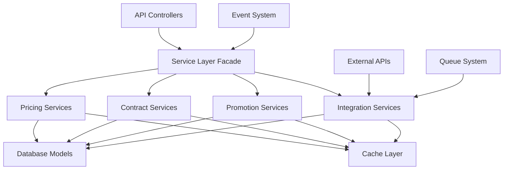
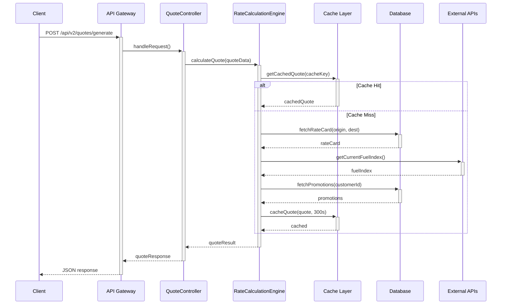
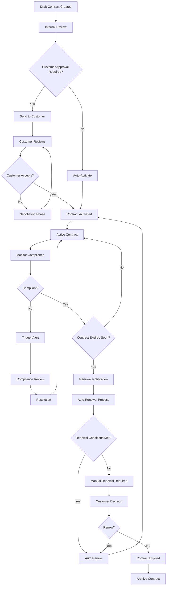
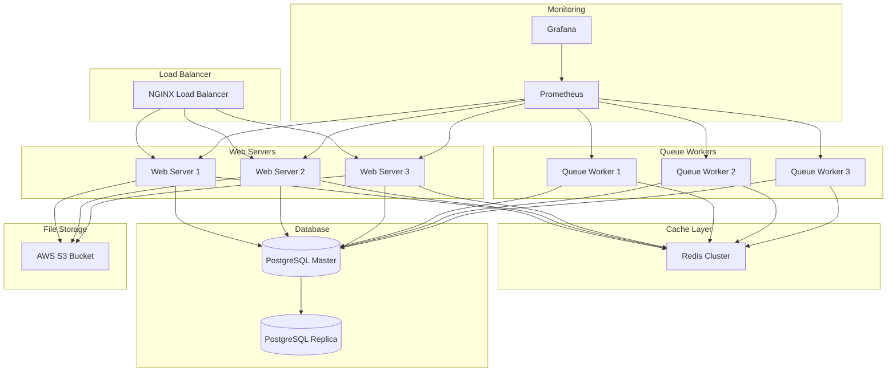

# Enhanced Logistics Pricing, Quotations, and Contracts System
## Comprehensive Technical Architecture Design

### Document Information
- **Version**: 1.0
- **Date**: November 7, 2025
- **Author**: Kilo Code
- **Status**: Draft for Review

---

## Table of Contents

1. [Executive Summary](#executive-summary)
2. [System Overview](#system-overview)
3. [Database Schema Design](#database-schema-design)
4. [Dynamic Rate Calculation Module](#dynamic-rate-calculation-module)
5. [Contract Management Framework](#contract-management-framework)
6. [Discount & Promotion Engine](#discount--promotion-engine)
7. [Service Layer Architecture](#service-layer-architecture)
8. [API Gateway Integration](#api-gateway-integration)
9. [Frontend Component Architecture](#frontend-component-architecture)
10. [Data Flow Diagrams](#data-flow-diagrams)
11. [Security Architecture](#security-architecture)
12. [Performance Optimization](#performance-optimization)
13. [Testing Strategy](#testing-strategy)
14. [External Service Integrations](#external-service-integrations)
15. [Deployment Architecture](#deployment-architecture)
16. [Implementation Roadmap](#implementation-roadmap)

---

## Executive Summary

This document outlines the comprehensive architecture for an enhanced logistics pricing, quotations, and contracts system built upon the existing Laravel logistics platform. The system introduces three core enhancement modules:

1. **Dynamic Rate Calculation Module**: Real-time pricing with instant quotes, zone-based pricing, service level multipliers, fuel surcharge automation, and competitor benchmarking
2. **Contract Management Framework**: Advanced contract lifecycle tracking, tiered service commitments, volume discounts, and automated renewal processes
3. **Discount & Promotion Engine**: Time-bound promotions, milestone tracking, anti-stacking logic, and effectiveness analytics

### Key Benefits
- **Real-time Pricing**: Sub-200ms quote generation with comprehensive rate calculations
- **Advanced Contract Management**: Full lifecycle automation with compliance monitoring
- **Intelligent Promotion Engine**: Contextual discount application with usage analytics
- **Scalable Architecture**: Event-driven design with microservices-ready components
- **Performance Optimized**: Caching strategies and database indexing for high-volume operations

---

## System Overview

### Architecture Principles
- **Event-Driven Design**: Real-time updates and notification system
- **Service-Oriented Architecture**: Modular, maintainable service components
- **Performance-First**: Optimized for high-volume quote generation
- **Security-By-Design**: Role-based access with comprehensive audit trails
- **Integration-Friendly**: API-first approach for third-party connectivity

### Technology Stack
- **Backend**: Laravel 10+ with PHP 8.2+
- **Database**: PostgreSQL with Redis for caching
- **Queue System**: Laravel Queues with Redis
- **API Layer**: Laravel API with versioning
- **Frontend**: React with TypeScript
- **External Integrations**: DHL API, EDI providers, Fuel Index APIs, Exchange Rate APIs

---

## Database Schema Design

### New Tables for Enhanced System

#### 1. Pricing Rules Table
```sql
CREATE TABLE pricing_rules (
    id BIGSERIAL PRIMARY KEY,
    name VARCHAR(255) NOT NULL,
    rule_type ENUM('base_rate', 'fuel_surcharge', 'tax', 'surcharge', 'discount') NOT NULL,
    conditions JSONB NOT NULL,
    calculation_formula TEXT NOT NULL,
    priority INTEGER NOT NULL DEFAULT 0,
    active BOOLEAN DEFAULT true,
    effective_from TIMESTAMP WITH TIME ZONE NOT NULL,
    effective_to TIMESTAMP WITH TIME ZONE,
    created_at TIMESTAMP WITH TIME ZONE DEFAULT NOW(),
    updated_at TIMESTAMP WITH TIME ZONE DEFAULT NOW()
);

CREATE INDEX idx_pricing_rules_type_active ON pricing_rules(rule_type, active);
CREATE INDEX idx_pricing_rules_effective ON pricing_rules(effective_from, effective_to);
```

#### 2. Service Level Definitions
```sql
CREATE TABLE service_level_definitions (
    id BIGSERIAL PRIMARY KEY,
    code VARCHAR(50) UNIQUE NOT NULL,
    name VARCHAR(255) NOT NULL,
    description TEXT,
    base_multiplier DECIMAL(4,2) NOT NULL DEFAULT 1.0,
    min_delivery_hours INTEGER,
    max_delivery_hours INTEGER,
    reliability_score DECIMAL(4,2) DEFAULT 95.0,
    sla_claims_covered BOOLEAN DEFAULT true,
    created_at TIMESTAMP WITH TIME ZONE DEFAULT NOW(),
    updated_at TIMESTAMP WITH TIME ZONE DEFAULT NOW()
);

INSERT INTO service_level_definitions (code, name, base_multiplier, min_delivery_hours, max_delivery_hours) VALUES
('STANDARD', 'Standard Service', 1.00, 24, 72),
('PRIORITY', 'Priority Service', 1.50, 12, 24),
('EXPRESS', 'Express Service', 2.00, 2, 12);
```

#### 3. Contract Templates
```sql
CREATE TABLE contract_templates (
    id BIGSERIAL PRIMARY KEY,
    name VARCHAR(255) NOT NULL,
    description TEXT,
    template_type ENUM('standard', 'enterprise', 'government') NOT NULL,
    terms_template JSONB NOT NULL,
    default_settings JSONB,
    approval_required BOOLEAN DEFAULT true,
    auto_renewal_enabled BOOLEAN DEFAULT false,
    created_by_id BIGINT REFERENCES users(id),
    created_at TIMESTAMP WITH TIME ZONE DEFAULT NOW(),
    updated_at TIMESTAMP WITH TIME ZONE DEFAULT NOW()
);
```

#### 4. Enhanced Contracts Table
```sql
ALTER TABLE contracts ADD COLUMN IF NOT EXISTS template_id BIGINT REFERENCES contract_templates(id);
ALTER TABLE contracts ADD COLUMN IF NOT EXISTS contract_type ENUM('customer', 'carrier', '3pl') DEFAULT 'customer';
ALTER TABLE contracts ADD COLUMN IF NOT EXISTS volume_commitment INTEGER;
ALTER TABLE contracts ADD COLUMN IF NOT EXISTS volume_commitment_period ENUM('monthly', 'quarterly', 'annually');
ALTER TABLE contracts ADD COLUMN IF NOT EXISTS current_volume INTEGER DEFAULT 0;
ALTER TABLE contracts ADD COLUMN IF NOT EXISTS discount_tiers JSONB;
ALTER TABLE contracts ADD COLUMN IF NOT EXISTS service_level_commitments JSONB;
ALTER TABLE contracts ADD COLUMN IF NOT EXISTS auto_renewal_terms JSONB;
ALTER TABLE contracts ADD COLUMN IF NOT EXISTS compliance_requirements JSONB;
ALTER TABLE contracts ADD COLUMN IF NOT EXISTS notification_settings JSONB;
```

#### 5. Promotional Campaigns
```sql
CREATE TABLE promotional_campaigns (
    id BIGSERIAL PRIMARY KEY,
    name VARCHAR(255) NOT NULL,
    description TEXT,
    promo_code VARCHAR(50) UNIQUE,
    campaign_type ENUM('percentage', 'fixed_amount', 'free_shipping', 'tier_upgrade') NOT NULL,
    value DECIMAL(10,2) NOT NULL,
    minimum_order_value DECIMAL(10,2),
    maximum_discount_amount DECIMAL(10,2),
    usage_limit INTEGER,
    usage_count INTEGER DEFAULT 0,
    customer_eligibility JSONB,
    stacking_allowed BOOLEAN DEFAULT false,
    effective_from TIMESTAMP WITH TIME ZONE NOT NULL,
    effective_to TIMESTAMP WITH TIME ZONE,
    is_active BOOLEAN DEFAULT true,
    created_at TIMESTAMP WITH TIME ZONE DEFAULT NOW(),
    updated_at TIMESTAMP WITH TIME ZONE DEFAULT NOW()
);

CREATE INDEX idx_promo_campaigns_active ON promotional_campaigns(is_active, effective_from, effective_to);
```

#### 6. Customer Milestone Tracking
```sql
CREATE TABLE customer_milestones (
    id BIGSERIAL PRIMARY KEY,
    customer_id BIGINT NOT NULL REFERENCES customers(id),
    milestone_type ENUM('shipment_count', 'revenue_volume', 'tenure', 'tier_upgrade') NOT NULL,
    milestone_value INTEGER NOT NULL,
    achieved_at TIMESTAMP WITH TIME ZONE NOT NULL,
    reward_given VARCHAR(100),
    reward_details JSONB,
    created_at TIMESTAMP WITH TIME ZONE DEFAULT NOW()
);

CREATE INDEX idx_customer_milestones_customer ON customer_milestones(customer_id);
CREATE INDEX idx_customer_milestones_type ON customer_milestones(milestone_type);
```

#### 7. Fuel Index Integration
```sql
CREATE TABLE fuel_indices (
    id BIGSERIAL PRIMARY KEY,
    source ENUM('eia', 'opec', 'custom') NOT NULL,
    index_value DECIMAL(6,2) NOT NULL,
    region VARCHAR(100),
    effective_date DATE NOT NULL,
    created_at TIMESTAMP WITH TIME ZONE DEFAULT NOW()
);

CREATE INDEX idx_fuel_indices_date ON fuel_indices(effective_date);
CREATE INDEX idx_fuel_indices_source ON fuel_indices(source);
```

#### 8. Competitor Price Tracking
```sql
CREATE TABLE competitor_prices (
    id BIGSERIAL PRIMARY KEY,
    carrier_name VARCHAR(100) NOT NULL,
    origin_country VARCHAR(2) NOT NULL,
    destination_country VARCHAR(2) NOT NULL,
    service_level VARCHAR(50) NOT NULL,
    price DECIMAL(10,2) NOT NULL,
    currency CHAR(3) DEFAULT 'USD',
    weight_kg DECIMAL(6,2),
    source_type ENUM('api', 'manual', 'web_scraping') NOT NULL,
    collected_at TIMESTAMP WITH TIME ZONE DEFAULT NOW(),
    created_at TIMESTAMP WITH TIME ZONE DEFAULT NOW()
);

CREATE INDEX idx_competitor_prices_route ON competitor_prices(origin_country, destination_country, service_level);
CREATE INDEX idx_competitor_prices_collected ON competitor_prices(collected_at);
```

---

## Dynamic Rate Calculation Module

### Architecture Overview
The Dynamic Rate Calculation Module provides real-time pricing capabilities with advanced algorithms for instant quote generation.

### Core Components

#### 1. Rate Calculation Engine
```php
<?php

namespace App\Services\Pricing;

use App\Models\RateCard;
use App\Models\ServiceLevelDefinition;
use App\Models\PricingRule;
use Illuminate\Support\Facades\Cache;
use Illuminate\Support\Facades\Log;

class RateCalculationEngine
{
    public function calculateQuote(array $quoteData): array
    {
        $cacheKey = $this->generateCacheKey($quoteData);
        
        return Cache::remember($cacheKey, 300, function () use ($quoteData) {
            $calculator = new QuoteCalculator($quoteData);
            
            return $calculator
                ->setBaseRate($this->getBaseRate($quoteData))
                ->applyZoneMultipliers($this->getZoneMultipliers($quoteData))
                ->applyServiceLevelMultipliers($this->getServiceLevelMultipliers($quoteData))
                ->applyDimensionalWeight($this->calculateDimensionalWeight($quoteData))
                ->applyCustomerDiscounts($this->getCustomerDiscounts($quoteData))
                ->applyContractOverrides($this->getContractOverrides($quoteData))
                ->applyPromotionalDiscounts($this->getPromotionalDiscounts($quoteData))
                ->applyFuelSurcharge($this->calculateFuelSurcharge())
                ->applyTaxes($this->calculateTaxes($quoteData))
                ->generateQuote();
        });
    }
    
    private function getBaseRate(array $quoteData): float
    {
        $rateCard = RateCard::byRoute(
            $quoteData['origin_country'],
            $quoteData['destination_country']
        )->first();
        
        if (!$rateCard) {
            throw new \Exception("No rate card found for route");
        }
        
        return $this->calculateBaseRateFromCard($rateCard, $quoteData);
    }
}
```

#### 2. Service Level Multipliers
```php
<?php

namespace App\Services\Pricing;

class ServiceLevelCalculator
{
    public function getServiceLevelMultipliers(string $serviceLevel): array
    {
        $definition = ServiceLevelDefinition::where('code', $serviceLevel)->first();
        
        if (!$definition) {
            $definition = ServiceLevelDefinition::where('code', 'STANDARD')->first();
        }
        
        return [
            'multiplier' => $definition->base_multiplier,
            'delivery_window' => [
                'min_hours' => $definition->min_delivery_hours,
                'max_hours' => $definition->max_delivery_hours
            ],
            'reliability_score' => $definition->reliability_score,
            'sla_claims_covered' => $definition->sla_claims_covered
        ];
    }
}
```

#### 3. Dimensional Weight Automation
```php
<?php

namespace App\Services\Pricing;

class DimensionalWeightCalculator
{
    private const DEFAULT_DIM_FACTORS = [
        'domestic' => 5000,
        'international' => 5000,
        'express' => 4000
    ];
    
    public function calculateBillableWeight(array $dimensions, float $actualWeight, string $serviceType = 'domestic'): float
    {
        $dimFactor = $this->getDimensionalFactor($serviceType);
        $volumeCm3 = $dimensions['length'] * $dimensions['width'] * $dimensions['height'];
        $dimWeight = $volumeCm3 / $dimFactor;
        
        // Return the greater of actual weight or dimensional weight
        return max($actualWeight, $dimWeight);
    }
    
    private function getDimensionalFactor(string $serviceType): int
    {
        return self::DEFAULT_DIM_FACTORS[$serviceType] ?? 5000;
    }
}
```

#### 4. Fuel Surcharge Engine
```php
<?php

namespace App\Services\Pricing;

use App\Models\FuelIndex;
use Carbon\Carbon;

class FuelSurchargeEngine
{
    public function calculateFuelSurcharge(float $baseAmount): array
    {
        $currentIndex = $this->getCurrentFuelIndex();
        $baseIndex = $this->getBaseFuelIndex();
        
        if ($currentIndex <= $baseIndex) {
            return ['surcharge_rate' => 0, 'amount' => 0];
        }
        
        $surchargeRate = (($currentIndex - $baseIndex) / $baseIndex) * 0.08; // 8% of the difference
        $surchargeAmount = $baseAmount * $surchargeRate;
        
        return [
            'surcharge_rate' => $surchargeRate,
            'amount' => $surchargeAmount,
            'current_index' => $currentIndex,
            'base_index' => $baseIndex,
            'effective_date' => Carbon::now()->toDateString()
        ];
    }
    
    private function getCurrentFuelIndex(): float
    {
        return Cache::remember('current_fuel_index', 3600, function () {
            return FuelIndex::where('effective_date', '<=', Carbon::now())
                ->orderBy('effective_date', 'desc')
                ->first()
                ->index_value ?? 100.0;
        });
    }
}
```

### API Endpoints for Rate Calculation

#### 1. Instant Quote Generation
```php
<?php

namespace App\Http\Controllers\Api\Pricing;

use App\Http\Controllers\Controller;
use App\Services\Pricing\RateCalculationEngine;
use Illuminate\Http\Request;
use Illuminate\Http\JsonResponse;

class QuoteController extends Controller
{
    public function __construct(
        private RateCalculationEngine $rateEngine
    ) {}
    
    public function generateQuote(Request $request): JsonResponse
    {
        $request->validate([
            'origin_country' => 'required|string|size:2',
            'destination_country' => 'required|string|size:2',
            'service_level' => 'required|string|in:STANDARD,PRIORITY,EXPRESS',
            'weight_kg' => 'required|numeric|min:0.1',
            'dimensions' => 'required|array',
            'dimensions.length' => 'required|numeric|min:1',
            'dimensions.width' => 'required|numeric|min:1',
            'dimensions.height' => 'required|numeric|min:1',
            'customer_id' => 'nullable|exists:customers,id',
            'promo_code' => 'nullable|string',
        ]);
        
        try {
            $quote = $this->rateEngine->calculateQuote($request->all());
            
            // Cache quote for potential conversion
            $quoteId = $this->cacheQuote($quote);
            
            return response()->json([
                'quote_id' => $quoteId,
                'quote' => $quote,
                'valid_until' => now()->addHours(24)->toISOString()
            ]);
            
        } catch (\Exception $e) {
            return response()->json(['error' => $e->getMessage()], 400);
        }
    }
}
```

#### 2. Bulk Quote Generation
```php
<?php

namespace App\Http\Controllers\Api\Pricing;

use App\Http\Controllers\Controller;
use App\Services\Pricing\BulkQuoteService;
use Illuminate\Http\Request;
use Illuminate\Http\JsonResponse;

class BulkQuoteController extends Controller
{
    public function generateBulkQuotes(Request $request): JsonResponse
    {
        $request->validate([
            'quotes' => 'required|array|min:1|max:100',
            'quotes.*.origin_country' => 'required|string|size:2',
            'quotes.*.destination_country' => 'required|string|size:2',
            'quotes.*.service_level' => 'required|string|in:STANDARD,PRIORITY,EXPRESS',
            'quotes.*.weight_kg' => 'required|numeric|min:0.1',
            'quotes.*.dimensions' => 'required|array',
        ]);
        
        $bulkService = new BulkQuoteService();
        $results = $bulkService->processBulkQuotes($request->input('quotes'));
        
        return response()->json([
            'batch_id' => $results['batch_id'],
            'total_quotes' => $results['total_quotes'],
            'successful_quotes' => $results['successful_quotes'],
            'failed_quotes' => $results['failed_quotes'],
            'quotes' => $results['quotes'],
            'processing_time_ms' => $results['processing_time_ms']
        ]);
    }
}
```

---

## Contract Management Framework

### Architecture Overview
The Contract Management Framework provides comprehensive lifecycle management for customer and carrier contracts with automated compliance monitoring and renewal processes.

### Core Components

#### 1. Contract Lifecycle Manager
```php
<?php

namespace App\Services\Contracts;

use App\Models\Contract;
use App\Models\ContractTemplate;
use Carbon\Carbon;
use Illuminate\Support\Facades\Log;
use Illuminate\Support\Facades\Notification;

class ContractLifecycleManager
{
    public function createContract(array $contractData): Contract
    {
        $template = ContractTemplate::find($contractData['template_id']);
        
        $contract = Contract::create([
            'customer_id' => $contractData['customer_id'],
            'name' => $contractData['name'],
            'contract_type' => $contractData['contract_type'] ?? 'customer',
            'template_id' => $template->id,
            'start_date' => $contractData['start_date'],
            'end_date' => $contractData['end_date'],
            'status' => 'draft',
            'terms' => $this->mergeTemplateWithData($template, $contractData),
            'volume_commitment' => $contractData['volume_commitment'] ?? null,
            'discount_tiers' => $contractData['discount_tiers'] ?? [],
            'service_level_commitments' => $contractData['service_level_commitments'] ?? [],
            'auto_renewal_terms' => $contractData['auto_renewal_terms'] ?? null,
            'compliance_requirements' => $contractData['compliance_requirements'] ?? [],
        ]);
        
        $this->notifyContractCreated($contract);
        
        return $contract;
    }
    
    public function transitionContract(Contract $contract, string $newStatus, string $reason = null): bool
    {
        $validTransitions = $this->getValidTransitions($contract->status);
        
        if (!in_array($newStatus, $validTransitions)) {
            throw new \Exception("Invalid contract status transition from {$contract->status} to {$newStatus}");
        }
        
        $oldStatus = $contract->status;
        $contract->update(['status' => $newStatus]);
        
        // Log the transition
        activity()
            ->performedOn($contract)
            ->causedBy(auth()->user())
            ->withProperties([
                'old_status' => $oldStatus,
                'new_status' => $newStatus,
                'reason' => $reason
            ])
            ->log("Contract status changed from {$oldStatus} to {$newStatus}");
        
        $this->handleStatusTransition($contract, $oldStatus, $newStatus);
        
        return true;
    }
    
    public function processAutomatedRenewals(): void
    {
        $contractsForRenewal = Contract::where('status', 'active')
            ->where('auto_renewal_terms', '!=', null)
            ->where('end_date', '<=', now()->addDays(30))
            ->get();
            
        foreach ($contractsForRenewal as $contract) {
            $this->processContractRenewal($contract);
        }
    }
}
```

#### 2. Volume Discount Calculator
```php
<?php

namespace App\Services\Contracts;

use App\Models\Contract;
use Carbon\Carbon;

class VolumeDiscountCalculator
{
    public function calculateVolumeDiscount(Contract $contract, int $currentVolume): array
    {
        $discountTiers = $contract->discount_tiers ?? [];
        $volumePeriod = $contract->volume_commitment_period ?? 'monthly';
        
        $periodStart = $this->getPeriodStart($volumePeriod);
        $actualVolume = $this->getActualVolumeForPeriod($contract->customer_id, $periodStart);
        
        $discountTier = $this->findMatchingTier($discountTiers, $actualVolume);
        
        if (!$discountTier) {
            return [
                'discount_percentage' => 0,
                'discount_amount' => 0,
                'current_tier' => null,
                'next_tier' => $this->getNextTier($discountTiers, $actualVolume)
            ];
        }
        
        return [
            'discount_percentage' => $discountTier['discount_percentage'],
            'discount_amount' => $this->calculateDiscountAmount($discountTier),
            'current_tier' => $discountTier,
            'achieved_volume' => $actualVolume,
            'tier_requirement' => $discountTier['volume_requirement'],
            'progress_percentage' => min(100, ($actualVolume / $discountTier['volume_requirement']) * 100)
        ];
    }
    
    private function getPeriodStart(string $period): Carbon
    {
        return match($period) {
            'monthly' => now()->startOfMonth(),
            'quarterly' => now()->startOfQuarter(),
            'annually' => now()->startOfYear(),
            default => now()->startOfMonth()
        };
    }
}
```

#### 3. Compliance Monitoring Service
```php
<?php

namespace App\Services\Contracts;

use App\Models\Contract;
use App\Models\ContractComplianceLog;
use Illuminate\Support\Facades\Notification;

class ComplianceMonitoringService
{
    public function monitorContractCompliance(Contract $contract): array
    {
        $complianceRequirements = $contract->compliance_requirements ?? [];
        $complianceResults = [];
        
        foreach ($complianceRequirements as $requirement) {
            $result = $this->checkComplianceRequirement($contract, $requirement);
            $complianceResults[] = $result;
            
            if (!$result['compliant']) {
                $this->triggerComplianceAlert($contract, $result);
            }
        }
        
        $this->logComplianceCheck($contract, $complianceResults);
        
        return [
            'contract_id' => $contract->id,
            'overall_compliance' => collect($complianceResults)->every('compliant'),
            'compliance_results' => $complianceResults,
            'checked_at' => now()
        ];
    }
    
    private function checkComplianceRequirement(Contract $contract, array $requirement): array
    {
        return match($requirement['type']) {
            'sla_delivery_time' => $this->checkSLADeliveryTime($contract),
            'damage_rate' => $this->checkDamageRate($contract),
            'volume_commitment' => $this->checkVolumeCommitment($contract),
            'payment_terms' => $this->checkPaymentTerms($contract),
            default => ['compliant' => true, 'message' => 'Unknown requirement type']
        };
    }
}
```

#### 4. Contract Template Manager
```php
<?php

namespace App\Services\Contracts;

use App\Models\ContractTemplate;
use Illuminate\Support\Facades\DB;

class ContractTemplateManager
{
    public function createTemplate(array $templateData): ContractTemplate
    {
        $template = ContractTemplate::create([
            'name' => $templateData['name'],
            'description' => $templateData['description'],
            'template_type' => $templateData['template_type'],
            'terms_template' => $this->validateTermsTemplate($templateData['terms_template']),
            'default_settings' => $templateData['default_settings'] ?? [],
            'approval_required' => $templateData['approval_required'] ?? true,
            'auto_renewal_enabled' => $templateData['auto_renewal_enabled'] ?? false,
            'created_by_id' => auth()->id(),
        ]);
        
        return $template;
    }
    
    public function validateTermsTemplate(array $termsTemplate): array
    {
        // Validate required fields
        $requiredFields = ['payment_terms', 'delivery_terms', 'liability'];
        $missingFields = array_diff($requiredFields, array_keys($termsTemplate));
        
        if (!empty($missingFields)) {
            throw new \Exception("Missing required terms: " . implode(', ', $missingFields));
        }
        
        return $termsTemplate;
    }
}
```

### Contract API Endpoints

#### 1. Contract CRUD Operations
```php
<?php

namespace App\Http\Controllers\Api\Contracts;

use App\Http\Controllers\Controller;
use App\Services\Contracts\ContractLifecycleManager;
use App\Services\Contracts\VolumeDiscountCalculator;
use Illuminate\Http\Request;
use Illuminate\Http\JsonResponse;

class ContractController extends Controller
{
    public function index(Request $request): JsonResponse
    {
        $query = Contract::with(['customer', 'template'])
            ->when($request->customer_id, function ($q) use ($request) {
                $q->where('customer_id', $request->customer_id);
            })
            ->when($request->status, function ($q) use ($request) {
                $q->where('status', $request->status);
            });
            
        $contracts = $query->paginate(15);
        
        return response()->json($contracts);
    }
    
    public function store(Request $request): JsonResponse
    {
        $request->validate([
            'customer_id' => 'required|exists:customers,id',
            'name' => 'required|string|max:255',
            'template_id' => 'required|exists:contract_templates,id',
            'start_date' => 'required|date',
            'end_date' => 'required|date|after:start_date',
            'contract_type' => 'nullable|in:customer,carrier,3pl',
            'volume_commitment' => 'nullable|integer|min:1',
            'discount_tiers' => 'nullable|array',
            'service_level_commitments' => 'nullable|array',
        ]);
        
        $contractManager = new ContractLifecycleManager();
        $contract = $contractManager->createContract($request->all());
        
        return response()->json([
            'message' => 'Contract created successfully',
            'contract' => $contract->load(['customer', 'template'])
        ], 201);
    }
    
    public function updateStatus(Request $request, Contract $contract): JsonResponse
    {
        $request->validate([
            'status' => 'required|in:draft,negotiation,active,expired,suspended,terminated',
            'reason' => 'nullable|string'
        ]);
        
        $contractManager = new ContractLifecycleManager();
        $contractManager->transitionContract($contract, $request->status, $request->reason);
        
        return response()->json([
            'message' => 'Contract status updated successfully',
            'contract' => $contract->fresh()
        ]);
    }
}
```

---

## Discount & Promotion Engine

### Architecture Overview
The Discount & Promotion Engine provides intelligent promotional code management with anti-stacking logic and effectiveness tracking.

### Core Components

#### 1. Promotion Validation Engine
```php
<?php

namespace App\Services\Promotions;

use App\Models\PromotionalCampaign;
use App\Models\Customer;
use App\Models\Quotation;
use Carbon\Carbon;

class PromotionValidationEngine
{
    public function validatePromoCode(string $promoCode, Customer $customer, Quotation $quotation): array
    {
        $campaign = PromotionalCampaign::where('promo_code', $promoCode)
            ->where('is_active', true)
            ->first();
            
        if (!$campaign) {
            return ['valid' => false, 'error' => 'Invalid promotional code'];
        }
        
        // Check date validity
        if (now()->isBefore($campaign->effective_from) || 
            (($campaign->effective_to && now()->isAfter($campaign->effective_to)))) {
            return ['valid' => false, 'error' => 'Promotional code has expired'];
        }
        
        // Check usage limits
        if ($campaign->usage_limit && $campaign->usage_count >= $campaign->usage_limit) {
            return ['valid' => false, 'error' => 'Promotional code usage limit reached'];
        }
        
        // Check customer eligibility
        if (!$this->isCustomerEligible($customer, $campaign)) {
            return ['valid' => false, 'error' => 'Customer not eligible for this promotion'];
        }
        
        // Check minimum order value
        if ($campaign->minimum_order_value && $quotation->total_amount < $campaign->minimum_order_value) {
            return ['valid' => false, 'error' => 'Minimum order value not met'];
        }
        
        return [
            'valid' => true,
            'campaign' => $campaign,
            'discount' => $this->calculateDiscount($campaign, $quotation)
        ];
    }
    
    public function checkAntiStacking(array $activePromotions, PromotionalCampaign $newCampaign): array
    {
        foreach ($activePromotions as $promotion) {
            if (!$promotion['campaign']->stacking_allowed || !$newCampaign->stacking_allowed) {
                return [
                    'allowed' => false,
                    'reason' => 'Promotional codes cannot be stacked',
                    'conflicting_promotion' => $promotion['campaign']
                ];
            }
        }
        
        return ['allowed' => true];
    }
}
```

#### 2. Discount Calculation Engine
```php
<?php

namespace App\Services\Promotions;

use App\Models\PromotionalCampaign;
use App\Models\Quotation;

class DiscountCalculationEngine
{
    public function calculateDiscount(PromotionalCampaign $campaign, Quotation $quotation): array
    {
        $baseAmount = $quotation->total_amount;
        $discountAmount = 0;
        
        switch ($campaign->campaign_type) {
            case 'percentage':
                $discountAmount = $baseAmount * ($campaign->value / 100);
                if ($campaign->maximum_discount_amount) {
                    $discountAmount = min($discountAmount, $campaign->maximum_discount_amount);
                }
                break;
                
            case 'fixed_amount':
                $discountAmount = min($campaign->value, $baseAmount);
                break;
                
            case 'free_shipping':
                $discountAmount = $this->getShippingCost($quotation);
                break;
                
            case 'tier_upgrade':
                return $this->calculateTierUpgrade($campaign, $quotation);
        }
        
        return [
            'type' => $campaign->campaign_type,
            'value' => $campaign->value,
            'discount_amount' => $discountAmount,
            'final_amount' => $baseAmount - $discountAmount,
            'discount_percentage' => ($discountAmount / $baseAmount) * 100
        ];
    }
}
```

#### 3. Milestone Tracking Service
```php
<?php

namespace App\Services\Promotions;

use App\Models\Customer;
use App\Models\CustomerMilestone;
use App\Models\Shipment;
use Carbon\Carbon;

class MilestoneTrackingService
{
    public function trackShipmentMilestone(Customer $customer, Shipment $shipment): void
    {
        // Track shipment count milestone
        $shipmentCount = $this->getCustomerShipmentCount($customer);
        $this->checkShipmentCountMilestone($customer, $shipmentCount);
        
        // Track revenue milestone
        $revenue = $this->getCustomerRevenue($customer);
        $this->checkRevenueMilestone($customer, $revenue);
        
        // Track tenure milestone
        $tenure = $this->calculateCustomerTenure($customer);
        $this->checkTenureMilestone($customer, $tenure);
    }
    
    private function checkShipmentCountMilestone(Customer $customer, int $shipmentCount): void
    {
        $milestoneThresholds = [10, 50, 100, 500, 1000];
        
        foreach ($milestoneThresholds as $threshold) {
            if ($shipmentCount === $threshold) {
                $this->recordMilestone($customer, 'shipment_count', $threshold, $this->getMilestoneReward('shipment_count', $threshold));
            }
        }
    }
    
    private function checkRevenueMilestone(Customer $customer, float $revenue): void
    {
        $revenueThresholds = [1000, 5000, 10000, 50000, 100000];
        
        foreach ($revenueThresholds as $threshold) {
            if ($revenue >= $threshold) {
                $existingMilestone = CustomerMilestone::where('customer_id', $customer->id)
                    ->where('milestone_type', 'revenue_volume')
                    ->where('milestone_value', $threshold)
                    ->exists();
                    
                if (!$existingMilestone) {
                    $this->recordMilestone($customer, 'revenue_volume', $threshold, $this->getMilestoneReward('revenue_volume', $threshold));
                }
            }
        }
    }
}
```

### Promotion API Endpoints

#### 1. Promotion Management
```php
<?php

namespace App\Http\Controllers\Api\Promotions;

use App\Http\Controllers\Controller;
use App\Services\Promotions\PromotionValidationEngine;
use App\Services\Promotions\MilestoneTrackingService;
use Illuminate\Http\Request;
use Illuminate\Http\JsonResponse;

class PromotionController extends Controller
{
    public function validatePromoCode(Request $request): JsonResponse
    {
        $request->validate([
            'promo_code' => 'required|string',
            'customer_id' => 'required|exists:customers,id',
            'quotation_id' => 'required|exists:quotations,id',
        ]);
        
        $customer = Customer::find($request->customer_id);
        $quotation = Quotation::find($request->quotation_id);
        
        $validationEngine = new PromotionValidationEngine();
        $result = $validationEngine->validatePromoCode($request->promo_code, $customer, $quotation);
        
        return response()->json($result);
    }
    
    public function applyPromotion(Request $request): JsonResponse
    {
        $request->validate([
            'promo_code' => 'required|string',
            'quotation_id' => 'required|exists:quotations,id',
        ]);
        
        $quotation = Quotation::find($request->quotation_id);
        $validationEngine = new PromotionValidationEngine();
        
        $result = $validationEngine->validatePromoCode($request->promo_code, $quotation->customer, $quotation);
        
        if (!$result['valid']) {
            return response()->json(['error' => $result['error']], 400);
        }
        
        // Apply the discount to the quotation
        $quotation->update([
            'promo_code' => $request->promo_code,
            'promotion_discount' => $result['discount']['discount_amount'],
            'final_amount' => $result['discount']['final_amount']
        ]);
        
        // Update campaign usage count
        $result['campaign']->increment('usage_count');
        
        return response()->json([
            'message' => 'Promotion applied successfully',
            'quotation' => $quotation->fresh(),
            'discount_applied' => $result['discount']
        ]);
    }
}
```

---

## Service Layer Architecture

### Service Class Relationships

The enhanced system follows a service-oriented architecture with clear separation of concerns:

#### Core Service Classes

1. **Pricing Services** (`App\Services\Pricing\`)
   - `RateCalculationEngine`: Main quote calculation logic
   - `ServiceLevelCalculator`: Service level multiplier calculations
   - `DimensionalWeightCalculator`: Weight and dimension calculations
   - `FuelSurchargeEngine`: Fuel surcharge calculations
   - `TaxCalculationEngine`: Tax calculations by jurisdiction

2. **Contract Services** (`App\Services\Contracts\`)
   - `ContractLifecycleManager`: Contract status management
   - `VolumeDiscountCalculator`: Volume-based discount calculations
   - `ComplianceMonitoringService`: Contract compliance tracking
   - `ContractTemplateManager`: Template management

3. **Promotion Services** (`App\Services\Promotions\`)
   - `PromotionValidationEngine`: Promo code validation
   - `DiscountCalculationEngine`: Discount calculations
   - `MilestoneTrackingService`: Customer milestone tracking
   - `CampaignEffectivenessService`: Analytics and reporting

4. **Integration Services** (`App\Services\Integration\`)
   - `ExternalFuelIndexService`: Fuel price data integration
   - `ExchangeRateService`: Currency conversion
   - `CompetitorPriceService`: Competitive pricing data
   - `WebhookEventService`: Event notifications

### Service Dependency Diagram



### Enhanced Repository Pattern

```php
<?php

namespace App\Repositories\Pricing;

use App\Models\RateCard;
use Illuminate\Database\Eloquent\Collection;
use Illuminate\Support\Facades\Cache;

class RateCardRepository
{
    public function findByRoute(string $origin, string $destination): ?RateCard
    {
        $cacheKey = "rate_card_{$origin}_{$destination}";
        
        return Cache::remember($cacheKey, 3600, function () use ($origin, $destination) {
            return RateCard::where('origin_country', $origin)
                ->where('dest_country', $destination)
                ->where('is_active', true)
                ->first();
        });
    }
    
    public function getZoneMatrix(string $origin, string $destination): array
    {
        $rateCard = $this->findByRoute($origin, $destination);
        return $rateCard ? $rateCard->zone_matrix : [];
    }
    
    public function updateCache(RateCard $rateCard): void
    {
        $cacheKey = "rate_card_{$rateCard->origin_country}_{$rateCard->dest_country}";
        Cache::put($cacheKey, $rateCard, 3600);
    }
}
```

---

## API Gateway Integration

### API Versioning Strategy
- **v1**: Legacy endpoints (maintenance mode)
- **v2**: Enhanced endpoints with new features
- **v3**: Microservices-ready endpoints (future)

### Authentication & Authorization
```php
<?php

namespace App\Http\Middleware;

use Closure;
use Illuminate\Http\Request;
use Symfony\Component\HttpFoundation\Response;

class ApiAuthentication
{
    public function handle(Request $request, Closure $next): Response
    {
        $token = $request->bearerToken();
        
        if (!$token || !$this->validateToken($token)) {
            return response()->json(['error' => 'Unauthorized'], 401);
        }
        
        $user = $this->getUserFromToken($token);
        $request->setUser($user);
        
        return $next($request);
    }
    
    private function validateToken(string $token): bool
    {
        // Implementation for API key validation
        return true; // Simplified for example
    }
}
```

### Rate Limiting Configuration
```php
<?php

// config/api.php
return [
    'rate_limits' => [
        'quote_generation' => '60,1', // 60 requests per minute
        'bulk_quote' => '10,1', // 10 requests per minute
        'contract_management' => '100,1', // 100 requests per minute
        'promotion_validation' => '200,1', // 200 requests per minute
    ],
    
    'cache_ttl' => [
        'quote_results' => 300, // 5 minutes
        'rate_cards' => 3600, // 1 hour
        'competitor_prices' => 1800, // 30 minutes
        'fuel_indices' => 3600, // 1 hour
    ]
];
```

### API Response Format Standards
```php
<?php

// Standardized API response format
class ApiResponse
{
    public static function success($data = null, string $message = 'Success', int $status = 200): JsonResponse
    {
        return response()->json([
            'success' => true,
            'message' => $message,
            'data' => $data,
            'timestamp' => now()->toISOString(),
            'request_id' => request()->header('X-Request-ID', uniqid())
        ], $status);
    }
    
    public static function error(string $message, int $status = 400, $errors = null): JsonResponse
    {
        return response()->json([
            'success' => false,
            'message' => $message,
            'errors' => $errors,
            'timestamp' => now()->toISOString(),
            'request_id' => request()->header('X-Request-ID', uniqid())
        ], $status);
    }
}
```

---

## Frontend Component Architecture

### React Component Structure

#### 1. Quote Generation Components
```typescript
// components/pricing/QuoteForm.tsx
import React, { useState, useEffect } from 'react';
import { QuoteService } from '../../services/QuoteService';

interface QuoteFormProps {
    customerId?: string;
    onQuoteGenerated: (quote: Quote) => void;
}

export const QuoteForm: React.FC<QuoteFormProps> = ({ customerId, onQuoteGenerated }) => {
    const [formData, setFormData] = useState<QuoteFormData>({
        originCountry: '',
        destinationCountry: '',
        serviceLevel: 'STANDARD',
        weightKg: 0,
        dimensions: { length: 0, width: 0, height: 0 },
        promoCode: ''
    });
    
    const [quote, setQuote] = useState<Quote | null>(null);
    const [loading, setLoading] = useState(false);
    
    const handleSubmit = async (e: React.FormEvent) => {
        e.preventDefault();
        setLoading(true);
        
        try {
            const quoteService = new QuoteService();
            const result = await quoteService.generateQuote(formData);
            setQuote(result);
            onQuoteGenerated(result);
        } catch (error) {
            console.error('Quote generation failed:', error);
        } finally {
            setLoading(false);
        }
    };
    
    return (
        <form onSubmit={handleSubmit} className="quote-form">
            {/* Form fields */}
            <div className="form-group">
                <label>Origin Country</label>
                <CountrySelect
                    value={formData.originCountry}
                    onChange={(value) => setFormData(prev => ({ ...prev, originCountry: value }))}
                />
            </div>
            
            <div className="form-group">
                <label>Service Level</label>
                <ServiceLevelSelect
                    value={formData.serviceLevel}
                    onChange={(value) => setFormData(prev => ({ ...prev, serviceLevel: value }))}
                />
            </div>
            
            <button type="submit" disabled={loading}>
                {loading ? 'Calculating...' : 'Generate Quote'}
            </button>
            
            {quote && (
                <QuoteBreakdown
                    quote={quote}
                    onAccept={() => onQuoteGenerated(quote)}
                    onDecline={() => setQuote(null)}
                />
            )}
        </form>
    );
};
```

#### 2. Contract Management Components
```typescript
// components/contracts/ContractBuilder.tsx
import React, { useState, useEffect } from 'react';
import { ContractService } from '../../services/ContractService';

export const ContractBuilder: React.FC = () => {
    const [contractData, setContractData] = useState<ContractData>({
        customerId: '',
        templateId: '',
        name: '',
        startDate: '',
        endDate: '',
        volumeCommitment: 0,
        discountTiers: [],
        serviceLevelCommitments: []
    });
    
    const [templates, setTemplates] = useState<ContractTemplate[]>([]);
    const [preview, setPreview] = useState<Contract | null>(null);
    
    useEffect(() => {
        const contractService = new ContractService();
        contractService.getTemplates().then(setTemplates);
    }, []);
    
    const handleSaveDraft = async () => {
        const contractService = new ContractService();
        const contract = await contractService.createContract(contractData);
        setPreview(contract);
    };
    
    return (
        <div className="contract-builder">
            <div className="builder-sidebar">
                <TemplateSelector
                    templates={templates}
                    selectedTemplateId={contractData.templateId}
                    onSelect={(templateId) => setContractData(prev => ({ ...prev, templateId }))}
                />
                
                <ContractTermsEditor
                    contractData={contractData}
                    onChange={setContractData}
                />
                
                <VolumeDiscountEditor
                    discountTiers={contractData.discountTiers}
                    onChange={(tiers) => setContractData(prev => ({ ...prev, discountTiers: tiers }))}
                />
            </div>
            
            <div className="builder-preview">
                <ContractPreview
                    contractData={contractData}
                    template={templates.find(t => t.id === contractData.templateId)}
                />
            </div>
        </div>
    );
};
```

#### 3. Promotion Management Components
```typescript
// components/promotions/PromotionDashboard.tsx
import React, { useState, useEffect } from 'react';
import { PromotionService } from '../../services/PromotionService';

export const PromotionDashboard: React.FC = () => {
    const [campaigns, setCampaigns] = useState<PromotionalCampaign[]>([]);
    const [analytics, setAnalytics] = useState<PromotionAnalytics | null>(null);
    
    useEffect(() => {
        loadDashboardData();
    }, []);
    
    const loadDashboardData = async () => {
        const promotionService = new PromotionService();
        const [campaignsData, analyticsData] = await Promise.all([
            promotionService.getActiveCampaigns(),
            promotionService.getAnalytics()
        ]);
        
        setCampaigns(campaignsData);
        setAnalytics(analyticsData);
    };
    
    return (
        <div className="promotion-dashboard">
            <div className="dashboard-header">
                <h2>Promotion Management</h2>
                <button onClick={() => setShowCreateModal(true)}>
                    Create New Campaign
                </button>
            </div>
            
            <div className="dashboard-grid">
                <PromotionMetricsCard
                    title="Active Campaigns"
                    value={campaigns.length}
                />
                
                <PromotionMetricsCard
                    title="Redemption Rate"
                    value={`${analytics?.redemptionRate}%`}
                />
                
                <PromotionMetricsCard
                    title="Total Discounts Given"
                    value={`$${analytics?.totalDiscounts?.toLocaleString()}`}
                />
            </div>
            
            <CampaignList
                campaigns={campaigns}
                onEdit={(campaign) => handleEditCampaign(campaign)}
                onDelete={(campaign) => handleDeleteCampaign(campaign)}
                onToggle={(campaign) => handleToggleCampaign(campaign)}
            />
        </div>
    );
};
```

### State Management with Redux Toolkit

```typescript
// store/pricingSlice.ts
import { createSlice, createAsyncThunk } from '@reduxjs/toolkit';
import { QuoteService } from '../../services/QuoteService';

interface PricingState {
    quotes: Quote[];
    loading: boolean;
    error: string | null;
    lastQuote: Quote | null;
}

const initialState: PricingState = {
    quotes: [],
    loading: false,
    error: null,
    lastQuote: null
};

export const generateQuote = createAsyncThunk(
    'pricing/generateQuote',
    async (quoteData: QuoteFormData) => {
        const quoteService = new QuoteService();
        return await quoteService.generateQuote(quoteData);
    }
);

const pricingSlice = createSlice({
    name: 'pricing',
    initialState,
    reducers: {
        clearError: (state) => {
            state.error = null;
        },
        clearQuotes: (state) => {
            state.quotes = [];
            state.lastQuote = null;
        }
    },
    extraReducers: (builder) => {
        builder
            .addCase(generateQuote.pending, (state) => {
                state.loading = true;
                state.error = null;
            })
            .addCase(generateQuote.fulfilled, (state, action) => {
                state.loading = false;
                state.quotes.push(action.payload);
                state.lastQuote = action.payload;
            })
            .addCase(generateQuote.rejected, (state, action) => {
                state.loading = false;
                state.error = action.error.message || 'Failed to generate quote';
            });
    }
});

export const { clearError, clearQuotes } = pricingSlice.actions;
export default pricingSlice.reducer;
```

---

## Data Flow Diagrams

### Quote Generation Flow



### Contract Lifecycle Flow



### Promotion Validation Flow

```mermaid
sequenceDiagram
    participant Customer
    participant QuoteService
    participant PromotionEngine
    participant Database
    participant Analytics
    
    Customer->>+QuoteService: applyPromoCode(code, quotation)
    QuoteService->>+PromotionEngine: validatePromoCode()
    
    PromotionEngine->>+Database: checkCampaign(code)
    Database-->>-PromotionEngine: campaign
    
    alt Campaign Not Found
        PromotionEngine-->>-QuoteService: invalidCampaign
    else Campaign Found
        PromotionEngine->>+Database: checkUsageLimits()
        Database-->>-PromotionEngine: usageCount
        
        PromotionEngine->>+Database: checkCustomerEligibility()
        Database-->>-PromotionEngine: eligible
        
        alt Not Eligible
            PromotionEngine-->>-QuoteService: notEligible
        else Eligible
            PromotionEngine->>+Analytics: trackValidation()
            Analytics-->>-PromotionEngine: tracked
            
            PromotionEngine->>+Database: checkAntiStacking()
            Database-->>-PromotionEngine: stackingAllowed
            
            alt Stacking Not Allowed
                PromotionEngine->>+Database: checkActivePromotions()
                Database-->>-PromotionEngine: activePromos
                alt Active Promotions Exist
                    PromotionEngine-->>-QuoteService: cannotStack
                else No Active Promotions
                    PromotionEngine-->>-QuoteService: validatedSuccessfully
                end
            else Stacking Allowed
                PromotionEngine-->>-QuoteService: validatedSuccessfully
            end
        end
    end
    
    QuoteService-->>-Customer: validationResult
```

---

## Security Architecture

### Authentication & Authorization

#### Role-Based Access Control
```php
<?php

namespace App\Policies;

use App\Models\User;
use App\Models\Contract;
use Illuminate\Auth\Access\Response;

class ContractPolicy
{
    public function viewAny(User $user): Response
    {
        return $user->can('view_contracts') 
            ? Response::allow()
            : Response::deny('Insufficient permissions to view contracts');
    }
    
    public function view(User $user, Contract $contract): Response
    {
        // Users can view contracts they own or have explicit permission
        return $user->id === $contract->customer_id || $user->can('view_all_contracts')
            ? Response::allow()
            : Response::deny('You can only view your own contracts');
    }
    
    public function create(User $user): Response
    {
        return $user->can('create_contracts')
            ? Response::allow()
            : Response::deny('You do not have permission to create contracts');
    }
    
    public function update(User $user, Contract $contract): Response
    {
        // Contract managers can update any contract
        // Customers can update their own contracts within limits
        if ($user->can('manage_all_contracts')) {
            return Response::allow();
        }
        
        if ($user->id === $contract->customer_id && $contract->status === 'draft') {
            return Response::allow();
        }
        
        return Response::deny('You can only update your own draft contracts');
    }
}
```

#### API Security Middleware
```php
<?php

namespace App\Http\Middleware;

use Closure;
use Illuminate\Http\Request;
use Symfony\Component\HttpFoundation\Response;

class ApiSecurityMiddleware
{
    public function handle(Request $request, Closure $next): Response
    {
        // Validate request signature
        if (!$this->validateRequestSignature($request)) {
            return response()->json(['error' => 'Invalid request signature'], 401);
        }
        
        // Rate limiting
        if (!$this->checkRateLimit($request)) {
            return response()->json(['error' => 'Rate limit exceeded'], 429);
        }
        
        // Data sanitization
        $this->sanitizeRequestData($request);
        
        return $next($request);
    }
    
    private function validateRequestSignature(Request $request): bool
    {
        $signature = $request->header('X-Signature');
        $timestamp = $request->header('X-Timestamp');
        $payload = $request->getContent();
        
        // Check timestamp freshness (5 minutes)
        if (abs(time() - $timestamp) > 300) {
            return false;
        }
        
        $expectedSignature = hash_hmac('sha256', $timestamp . $payload, config('app.api_secret'));
        
        return hash_equals($expectedSignature, $signature);
    }
}
```

### Data Encryption & Protection

#### Sensitive Data Encryption
```php
<?php

namespace App\Services\Security;

use Illuminate\Support\Facades\Crypt;
use Illuminate\Support\Facades\Log;

class SensitiveDataEncryption
{
    public function encryptContractTerms(array $terms): string
    {
        $json = json_encode($terms);
        return Crypt::encryptString($json);
    }
    
    public function decryptContractTerms(string $encryptedTerms): array
    {
        try {
            $decrypted = Crypt::decryptString($encryptedTerms);
            return json_decode($decrypted, true);
        } catch (\Exception $e) {
            Log::error('Failed to decrypt contract terms', ['error' => $e->getMessage()]);
            throw new \Exception('Invalid encrypted data');
        }
    }
    
    public function hashPromoCode(string $promoCode): string
    {
        return hash('sha256', $promoCode . config('app.salt'));
    }
}
```

### Audit Logging

#### Comprehensive Audit Trail
```php
<?php

namespace App\Services\Audit;

use App\Models\AuditLog;
use Illuminate\Support\Facades\Auth;
use Illuminate\Support\Facades\Request;

class AuditService
{
    public function logContractAction(Contract $contract, string $action, array $context = []): void
    {
        AuditLog::create([
            'user_id' => Auth::id(),
            'entity_type' => 'Contract',
            'entity_id' => $contract->id,
            'action' => $action,
            'old_values' => $this->getOldValues($contract),
            'new_values' => $this->getNewValues($contract, $context),
            'ip_address' => Request::ip(),
            'user_agent' => Request::userAgent(),
            'request_id' => Request::header('X-Request-ID'),
            'timestamp' => now()
        ]);
    }
    
    public function logQuoteGeneration(array $quoteData, array $result, float $processingTime): void
    {
        AuditLog::create([
            'user_id' => Auth::id(),
            'entity_type' => 'Quote',
            'action' => 'GENERATED',
            'old_values' => null,
            'new_values' => [
                'quote_data' => $this->sanitizeQuoteData($quoteData),
                'result_summary' => [
                    'total_amount' => $result['grand_total'],
                    'service_level' => $quoteData['service_level'],
                    'processing_time_ms' => $processingTime
                ]
            ],
            'ip_address' => Request::ip(),
            'request_id' => $this->getRequestId()
        ]);
    }
}
```

---

## Performance Optimization

### Database Optimization

#### Indexing Strategy
```sql
-- Performance indexes for quote generation
CREATE INDEX CONCURRENTLY idx_rate_cards_active_route 
    ON rate_cards(is_active, origin_country, dest_country) 
    WHERE is_active = true;

CREATE INDEX CONCURRENTLY idx_contracts_customer_status 
    ON contracts(customer_id, status, start_date, end_date);

CREATE INDEX CONCURRENTLY idx_quotations_customer_date 
    ON quotations(customer_id, created_at DESC);

CREATE INDEX CONCURRENTLY idx_promotional_campaigns_active_dates 
    ON promotional_campaigns(is_active, effective_from, effective_to);

-- Composite indexes for common query patterns
CREATE INDEX CONCURRENTLY idx_shipments_pricing_lookup 
    ON shipments(origin_country, dest_country, service_level, created_at DESC);
```

#### Query Optimization
```php
<?php

namespace App\Repositories;

use App\Models\RateCard;
use Illuminate\Database\Eloquent\Collection;
use Illuminate\Support\Facades\DB;

class OptimizedRateCardRepository
{
    public function getRatesForBulkCalculation(array $origins, array $destinations, string $serviceLevel): Collection
    {
        // Use single query with IN clauses for better performance
        return RateCard::where('is_active', true)
            ->whereIn('origin_country', $origins)
            ->whereIn('dest_country', $destinations)
            ->whereJsonContains('service_levels', $serviceLevel)
            ->select('id', 'origin_country', 'dest_country', 'zone_matrix', 'weight_rules')
            ->get();
    }
    
    public function getCachedRateForRoute(string $origin, string $destination, string $serviceLevel): ?array
    {
        $cacheKey = "rate:{$origin}:{$destination}:{$serviceLevel}";
        
        return cache()->remember($cacheKey, 1800, function () use ($origin, $destination, $serviceLevel) {
            $rateCard = RateCard::where('origin_country', $origin)
                ->where('dest_country', $destination)
                ->where('is_active', true)
                ->first();
                
            if (!$rateCard) {
                return null;
            }
            
            return [
                'base_rate' => $rateCard->getBaseRateForService($serviceLevel),
                'zone_matrix' => $rateCard->zone_matrix,
                'fuel_surcharge_rate' => $rateCard->fuel_surcharge_percent
            ];
        });
    }
}
```

### Caching Strategy

#### Multi-Level Caching
```php
<?php

namespace App\Services\Cache;

use Illuminate\Support\Facades\Cache;
use Illuminate\Support\Facades\Redis;

class MultiLevelCacheService
{
    private const L1_TTL = 300;  // 5 minutes - memory cache
    private const L2_TTL = 1800; // 30 minutes - Redis cache
    private const L3_TTL = 3600; // 1 hour - database fallback
    
    public function getQuote(string $cacheKey): ?array
    {
        // L1: Memory cache (fastest)
        $quote = cache($cacheKey);
        if ($quote) {
            return $quote;
        }
        
        // L2: Redis cache (fast)
        $quote = Redis::get("quotes:{$cacheKey}");
        if ($quote) {
            $quote = json_decode($quote, true);
            // Store in L1 for next request
            cache([$cacheKey => $quote], self::L1_TTL);
            return $quote;
        }
        
        return null;
    }
    
    public function storeQuote(string $cacheKey, array $quote): void
    {
        // Store in all levels
        cache([$cacheKey => $quote], self::L1_TTL);
        Redis::setex("quotes:{$cacheKey}", self::L2_TTL, json_encode($quote));
        
        // Also store in database for persistence
        $this->storeInPersistentCache($cacheKey, $quote);
    }
}
```

### Queue Processing

#### Asynchronous Quote Processing
```php
<?php

namespace App\Jobs;

use App\Services\Pricing\RateCalculationEngine;
use Illuminate\Bus\Queueable;
use Illuminate\Contracts\Queue\ShouldQueue;
use Illuminate\Foundation\Bus\Dispatchable;

class BulkQuoteCalculationJob implements ShouldQueue
{
    use Dispatchable, Queueable;
    
    public $timeout = 300; // 5 minutes
    public $tries = 3;
    
    public function __construct(
        private array $quotes,
        private string $batchId,
        private array $callback
    ) {}
    
    public function handle(RateCalculationEngine $rateEngine): void
    {
        $results = [];
        $startTime = microtime(true);
        
        foreach ($this->quotes as $index => $quoteData) {
            try {
                $result = $rateEngine->calculateQuote($quoteData);
                $results[] = [
                    'index' => $index,
                    'success' => true,
                    'quote' => $result
                ];
            } catch (\Exception $e) {
                $results[] = [
                    'index' => $index,
                    'success' => false,
                    'error' => $e->getMessage()
                ];
            }
        }
        
        $processingTime = (microtime(true) - $startTime) * 1000;
        
        // Send callback notification
        $this->sendResults($results, $processingTime);
    }
    
    private function sendResults(array $results, float $processingTime): void
    {
        // Implementation for sending results back to client
        // Could be via webhook, email, or database update
    }
}
```

---

## Testing Strategy

### Unit Testing

#### Quote Calculation Testing
```php
<?php

namespace Tests\Unit\Services\Pricing;

use Tests\TestCase;
use App\Services\Pricing\RateCalculationEngine;
use App\Models\RateCard;
use App\Models\ServiceLevelDefinition;

class RateCalculationEngineTest extends TestCase
{
    private RateCalculationEngine $engine;
    
    protected function setUp(): void
    {
        parent::setUp();
        $this->engine = new RateCalculationEngine();
    }
    
    public function test_basic_quote_calculation(): void
    {
        // Arrange
        $quoteData = [
            'origin_country' => 'US',
            'destination_country' => 'CA',
            'service_level' => 'STANDARD',
            'weight_kg' => 5,
            'dimensions' => [
                'length' => 30,
                'width' => 20,
                'height' => 15
            ]
        ];
        
        // Mock rate card
        RateCard::factory()->create([
            'origin_country' => 'US',
            'dest_country' => 'CA',
            'is_active' => true,
            'zone_matrix' => ['A' => 10.0, 'B' => 15.0]
        ]);
        
        // Act
        $result = $this->engine->calculateQuote($quoteData);
        
        // Assert
        $this->assertArrayHasKey('base_rate', $result);
        $this->assertArrayHasKey('grand_total', $result);
        $this->assertGreaterThan(0, $result['base_rate']);
        $this->assertGreaterThan(0, $result['grand_total']);
        $this->assertGreaterThanOrEqual($result['base_rate'], $result['grand_total']);
    }
    
    public function test_dimensional_weight_calculation(): void
    {
        // Test that dimensional weight is properly calculated
        // and used when greater than actual weight
    }
    
    public function test_fuel_surcharge_calculation(): void
    {
        // Test fuel surcharge calculation with different indices
    }
}
```

### Integration Testing

#### API Integration Tests
```php
<?php

namespace Tests\Integration\Http\Controllers\Api;

use Tests\TestCase;
use App\Models\Customer;
use App\Models\RateCard;
use Illuminate\Foundation\Testing\RefreshDatabase;

class QuoteControllerIntegrationTest extends TestCase
{
    use RefreshDatabase;
    
    public function test_generate_quote_endpoint(): void
    {
        // Arrange
        $customer = Customer::factory()->create();
        $rateCard = RateCard::factory()->create([
            'origin_country' => 'US',
            'dest_country' => 'CA',
            'is_active' => true
        ]);
        
        $requestData = [
            'origin_country' => 'US',
            'destination_country' => 'CA',
            'service_level' => 'STANDARD',
            'weight_kg' => 5,
            'dimensions' => [
                'length' => 30,
                'width' => 20,
                'height' => 15
            ],
            'customer_id' => $customer->id
        ];
        
        // Act
        $response = $this->postJson('/api/v2/quotes/generate', $requestData);
        
        // Assert
        $response->assertStatus(200)
            ->assertJsonStructure([
                'quote_id',
                'quote' => [
                    'base_rate',
                    'grand_total',
                    'currency',
                    'breakdown'
                ],
                'valid_until'
            ]);
            
        $this->assertNotNull($response->json('quote.base_rate'));
        $this->assertGreaterThan(0, $response->json('quote.grand_total'));
    }
    
    public function test_promotion_application(): void
    {
        // Test promotion code validation and application
    }
    
    public function test_contract_discount_application(): void
    {
        // Test contract-based discount application
    }
}
```

### Performance Testing

#### Load Testing Script
```php
<?php

namespace Tests\Performance;

use Tests\TestCase;
use Illuminate\Support\Facades\Artisan;

class QuoteGenerationLoadTest extends TestCase
{
    public function test_quote_generation_performance(): void
    {
        $startTime = microtime(true);
        $successfulRequests = 0;
        $totalRequests = 100;
        
        for ($i = 0; $i < $totalRequests; $i++) {
            $requestData = [
                'origin_country' => 'US',
                'destination_country' => 'CA',
                'service_level' => 'STANDARD',
                'weight_kg' => rand(1, 50),
                'dimensions' => [
                    'length' => rand(10, 100),
                    'width' => rand(10, 100),
                    'height' => rand(10, 100)
                ]
            ];
            
            $response = $this->postJson('/api/v2/quotes/generate', $requestData);
            
            if ($response->isSuccessful()) {
                $successfulRequests++;
            }
        }
        
        $endTime = microtime(true);
        $totalTime = $endTime - $startTime;
        $averageResponseTime = ($totalTime / $totalRequests) * 1000; // in milliseconds
        
        // Assertions
        $this->assertGreaterThanOrEqual(95, ($successfulRequests / $totalRequests) * 100, 'Success rate should be at least 95%');
        $this->assertLessThan(200, $averageResponseTime, 'Average response time should be under 200ms');
        
        echo "Performance Results:\n";
        echo "Success Rate: " . (($successfulRequests / $totalRequests) * 100) . "%\n";
        echo "Average Response Time: {$averageResponseTime}ms\n";
        echo "Total Time: {$totalTime}s\n";
    }
}
```

### Test Coverage Requirements

#### Coverage Goals
- **Unit Tests**: 90%+ code coverage for service classes
- **Integration Tests**: 80%+ coverage for API endpoints
- **Feature Tests**: 70%+ coverage for user workflows
- **Performance Tests**: Critical path validation

#### Testing Categories
1. **Business Logic Tests** (40% of test suite)
2. **API Endpoint Tests** (30% of test suite)
3. **Integration Tests** (20% of test suite)
4. **Performance & Load Tests** (10% of test suite)

---

## External Service Integrations

### Fuel Index Integration

#### EIA API Integration
```php
<?php

namespace App\Services\Integration;

use GuzzleHttp\Client;
use Carbon\Carbon;

class FuelIndexService
{
    private Client $httpClient;
    private string $apiKey;
    private string $baseUrl = 'https://api.eia.gov/v2/';
    
    public function __construct()
    {
        $this->httpClient = new Client([
            'timeout' => 10,
            'headers' => [
                'X-API-Key' => config('services.eia.api_key')
            ]
        ]);
    }
    
    public function fetchCurrentFuelIndex(string $region = 'US'): array
    {
        try {
            $response = $this->httpClient->get($this->baseUrl . 'petroleum/pri/gnd/data', [
                'query' => [
                    'frequency' => 'monthly',
                    'data[0]' => 'value',
                    'facets[product]' => 'EPMR',
                    'start' => Carbon::now()->subMonths(2)->format('Y-m'),
                    'end' => Carbon::now()->format('Y-m')
                ]
            ]);
            
            $data = json_decode($response->getBody(), true);
            
            if (!$data || empty($data['response']['data'])) {
                throw new \Exception('Invalid fuel index data received');
            }
            
            $latestIndex = end($data['response']['data']);
            
            return [
                'source' => 'eia',
                'index_value' => $latestIndex['value'],
                'effective_date' => $latestIndex['period'],
                'region' => $region,
                'fetched_at' => now()
            ];
            
        } catch (\Exception $e) {
            Log::error('Failed to fetch fuel index', ['error' => $e->getMessage()]);
            throw $e;
        }
    }
    
    public function storeFuelIndex(array $fuelIndexData): void
    {
        \App\Models\FuelIndex::updateOrCreate(
            [
                'source' => $fuelIndexData['source'],
                'effective_date' => $fuelIndexData['effective_date'],
                'region' => $fuelIndexData['region']
            ],
            $fuelIndexData
        );
    }
}
```

### Exchange Rate Integration

#### Multi-Source Exchange Rate Service
```php
<?php

namespace App\Services\Integration;

use GuzzleHttp\Client;
use Illuminate\Support\Facades\Cache;

class ExchangeRateService
{
    private Client $httpClient;
    private array $sources;
    
    public function __construct()
    {
        $this->httpClient = new Client(['timeout' => 10]);
        $this->sources = [
            'fixer' => config('services.fixer.api_key'),
            'openexchangerates' => config('services.openexchangerates.app_id')
        ];
    }
    
    public function getExchangeRate(string $from, string $to): float
    {
        $cacheKey = "exchange_rate:{$from}:{$to}";
        
        return Cache::remember($cacheKey, 3600, function () use ($from, $to) {
            // Try primary source first
            $rate = $this->getRateFromFixer($from, $to);
            
            if (!$rate) {
                // Fallback to secondary source
                $rate = $this->getRateFromOpenExchangeRates($from, $to);
            }
            
            if (!$rate) {
                // Use cached rate as last resort
                $rate = $this->getCachedRate($from, $to);
            }
            
            return $rate;
        });
    }
    
    private function getRateFromFixer(string $from, string $to): ?float
    {
        try {
            $response = $this->httpClient->get('http://data.fixer.io/api/latest', [
                'query' => [
                    'access_key' => $this->sources['fixer'],
                    'symbols' => $to
                ]
            ]);
            
            $data = json_decode($response->getBody(), true);
            
            if ($data['success'] && isset($data['rates'][$to])) {
                return $data['rates'][$to];
            }
            
            return null;
            
        } catch (\Exception $e) {
            Log::warning('Fixer API failed', ['error' => $e->getMessage()]);
            return null;
        }
    }
}
```

### DHL API Integration

#### Lane Rate Integration
```php
<?php

namespace App\Services\Integration;

use GuzzleHttp\Client;
use Illuminate\Support\Facades\Log;

class DHLIntegrationService
{
    private Client $httpClient;
    private string $baseUrl;
    private string $apiKey;
    
    public function __construct()
    {
        $this->baseUrl = config('services.dhl.api_url', 'https://api-mock.dhl.com');
        $this->apiKey = config('services.dhl.api_key');
        
        $this->httpClient = new Client([
            'base_uri' => $this->baseUrl,
            'headers' => [
                'DHL-API-Key' => $this->apiKey,
                'Content-Type' => 'application/json'
            ],
            'timeout' => 15
        ]);
    }
    
    public function getDhlRates(array $shipmentData): array
    {
        try {
            $requestPayload = $this->buildDhlRateRequest($shipmentData);
            
            $response = $this->httpClient->post('/rates', [
                'json' => $requestPayload
            ]);
            
            $rates = json_decode($response->getBody(), true);
            
            return $this->normalizeDhlRates($rates);
            
        } catch (\Exception $e) {
            Log::error('DHL rate request failed', ['error' => $e->getMessage()]);
            throw new \Exception('Unable to fetch DHL rates: ' . $e->getMessage());
        }
    }
    
    private function buildDhlRateRequest(array $shipmentData): array
    {
        return [
            'plannedShippingDateAndTime' => now()->addDays(1)->toISOString(),
            'unitOfMeasurement' => 'metric',
            'requestAllValueAddedServices' => true,
            'requestEstimatedDeliveryDate' => true,
            'isCustomsDeclarable' => false,
            'requestValueAddedServices' => false,
            'accounts' => [],
            'customerDetails' => [
                'shipperDetails' => [
                    'postalAddress' => [
                        'cityName' => $shipmentData['origin_city'],
                        'countryCode' => $shipmentData['origin_country']
                    ]
                ],
                'receiverDetails' => [
                    'postalAddress' => [
                        'cityName' => $shipmentData['destination_city'],
                        'countryCode' => $shipmentData['destination_country']
                    ]
                ]
            ],
            'packages' => [
                [
                    'weight' => $shipmentData['weight_kg'],
                    'dimensions' => [
                        'length' => $shipmentData['dimensions']['length'],
                        'width' => $shipmentData['dimensions']['width'],
                        'height' => $shipmentData['dimensions']['height']
                    ]
                ]
            ]
        ];
    }
    
    private function normalizeDhlRates(array $dhlRates): array
    {
        $normalizedRates = [];
        
        foreach ($dhlRates['products'] as $product) {
            $normalizedRates[] = [
                'carrier' => 'DHL',
                'service_code' => $product['productCode'],
                'service_name' => $product['productName'],
                'total_price' => $product['totalPrice'][0]['price'],
                'currency' => $product['totalPrice'][0]['currencyType'],
                'delivery_time' => $product['deliveryCapabilities']['estimatedDeliveryDateAndTime'],
                'transit_time' => $product['deliveryCapabilities']['totalTransitDays']
            ];
        }
        
        return $normalizedRates;
    }
}
```

### Webhook Management

#### Event-Driven Notifications
```php
<?php

namespace App\Services;

use App\Models\Webhook;
use App\Models\WebhookEndpoint;
use GuzzleHttp\Client;
use Illuminate\Support\Facades\Log;

class WebhookEventService
{
    private Client $httpClient;
    
    public function __construct()
    {
        $this->httpClient = new Client(['timeout' => 5, 'verify' => false]);
    }
    
    public function fireEvent(string $eventType, array $payload): void
    {
        $webhooks = Webhook::where('event_type', $eventType)
            ->where('is_active', true)
            ->get();
            
        foreach ($webhooks as $webhook) {
            $this->sendWebhook($webhook, $payload);
        }
    }
    
    public function sendWebhook(Webhook $webhook, array $payload): void
    {
        $endpoint = $webhook->endpoint;
        
        $webhookData = [
            'event' => $webhook->event_type,
            'timestamp' => now()->toISOString(),
            'data' => $payload,
            'signature' => $this->generateSignature($payload, $endpoint->secret)
        ];
        
        try {
            $response = $this->httpClient->post($endpoint->url, [
                'json' => $webhookData,
                'headers' => [
                    'User-Agent' => 'LogisticsSystem/1.0',
                    'Content-Type' => 'application/json'
                ]
            ]);
            
            if ($response->getStatusCode() >= 200 && $response->getStatusCode() < 300) {
                $this->logSuccessfulDelivery($webhook, $response);
            } else {
                $this->logFailedDelivery($webhook, $response, 'HTTP Error');
            }
            
        } catch (\Exception $e) {
            $this->logFailedDelivery($webhook, null, $e->getMessage());
        }
    }
    
    private function generateSignature(array $payload, string $secret): string
    {
        $payloadString = json_encode($payload);
        return hash_hmac('sha256', $payloadString, $secret);
    }
}
```

---

## Deployment Architecture

### Infrastructure Overview



### Docker Configuration

#### Multi-Stage Dockerfile
```dockerfile
# Build stage
FROM composer:2.5 as composer
COPY composer.json composer.lock ./
RUN composer install --no-dev --optimize-autoloader

# Application stage
FROM php:8.2-fpm-alpine

# Install system dependencies
RUN apk add --no-cache \
    nginx \
    supervisor \
    postgresql-client \
    redis \
    curl \
    supervisor

# Install PHP extensions
RUN docker-php-ext-install pdo pdo_mysql redis

# Copy application
COPY . /var/www/html

# Copy built dependencies
COPY --from=composer /var/www/html/vendor /var/www/html/vendor

# Set permissions
RUN chown -R www-data:www-data /var/www/html
RUN chmod -R 755 /var/www/html

# Copy configuration files
COPY docker/nginx.conf /etc/nginx/nginx.conf
COPY docker/supervisord.conf /etc/supervisord.conf

# Expose port
EXPOSE 80

# Health check
HEALTHCHECK --interval=30s --timeout=3s --start-period=5s --retries=3 \
    CMD curl -f http://localhost/health || exit 1

CMD ["/usr/bin/supervisord", "-c", "/etc/supervisord.conf"]
```

#### Docker Compose Configuration
```yaml
version: '3.8'

services:
  app:
    build: .
    ports:
      - "80:80"
    environment:
      - APP_ENV=production
      - DB_HOST=postgres
      - REDIS_HOST=redis
    depends_on:
      - postgres
      - redis
    volumes:
      - ./storage:/var/www/html/storage
    networks:
      - logistics

  postgres:
    image: postgres:15
    environment:
      - POSTGRES_DB=logistics
      - POSTGRES_USER=logistics
      - POSTGRES_PASSWORD=secure_password
    volumes:
      - postgres_data:/var/lib/postgresql/data
    networks:
      - logistics

  redis:
    image: redis:7-alpine
    command: redis-server --appendonly yes
    volumes:
      - redis_data:/data
    networks:
      - logistics

  nginx:
    image: nginx:alpine
    ports:
      - "443:443"
    volumes:
      - ./docker/nginx/nginx.conf:/etc/nginx/nginx.conf
      - ./ssl:/etc/nginx/ssl
    depends_on:
      - app
    networks:
      - logistics

volumes:
  postgres_data:
  redis_data:

networks:
  logistics:
    driver: bridge
```

### Kubernetes Deployment

#### Deployment Configuration
```yaml
apiVersion: apps/v1
kind: Deployment
metadata:
  name: logistics-app
  namespace: logistics-system
spec:
  replicas: 3
  selector:
    matchLabels:
      app: logistics-app
  template:
    metadata:
      labels:
        app: logistics-app
    spec:
      containers:
      - name: app
        image: logistics/system:latest
        ports:
        - containerPort: 80
        env:
        - name: DB_HOST
          valueFrom:
            configMapKeyRef:
              name: app-config
              key: db_host
        - name: REDIS_HOST
          valueFrom:
            configMapKeyRef:
              name: app-config
              key: redis_host
        resources:
          requests:
            memory: "512Mi"
            cpu: "250m"
          limits:
            memory: "1Gi"
            cpu: "500m"
        livenessProbe:
          httpGet:
            path: /health
            port: 80
          initialDelaySeconds: 30
          periodSeconds: 10
        readinessProbe:
          httpGet:
            path: /ready
            port: 80
          initialDelaySeconds: 5
          periodSeconds: 5
---
apiVersion: v1
kind: Service
metadata:
  name: logistics-app-service
  namespace: logistics-system
spec:
  selector:
    app: logistics-app
  ports:
  - port: 80
    targetPort: 80
  type: ClusterIP
```

### CI/CD Pipeline

#### GitHub Actions Workflow
```yaml
name: Deploy Logistics System

on:
  push:
    branches: [ main, develop ]
  pull_request:
    branches: [ main ]

jobs:
  test:
    runs-on: ubuntu-latest
    services:
      postgres:
        image: postgres:15
        env:
          POSTGRES_PASSWORD: password
        options: >-
          --health-cmd pg_isready
          --health-interval 10s
          --health-timeout 5s
          --health-retries 5
      redis:
        image: redis:7
        options: >-
          --health-cmd "redis-cli ping"
          --health-interval 10s
          --health-timeout 5s
          --health-retries 5
    
    steps:
    - uses: actions/checkout@v3
    
    - name: Setup PHP
      uses: shivammathur/setup-php@v2
      with:
        php-version: '8.2'
        extensions: mbstring, xml, ctype, iconv, intl, pdo, pdo_mysql, dom, filter, gd, json
        
    - name: Install dependencies
      run: composer install --no-progress --prefer-dist --optimize-autoloader
    
    - name: Generate key
      run: php artisan key:generate
      
    - name: Directory permissions
      run: chmod -R 775 storage bootstrap/cache
    
    - name: Run tests
      env:
        DB_CONNECTION: pgsql
        DB_HOST: localhost
        DB_PORT: 5432
        DB_DATABASE: postgres
        DB_USERNAME: postgres
        DB_PASSWORD: password
        APP_ENV: testing
      run: php artisan test --verbose
      
    - name: Run Pest tests
      run: ./vendor/bin/pest
      
    - name: Run static analysis
      run: ./vendor/bin/phpstan analyse

  deploy:
    needs: test
    runs-on: ubuntu-latest
    if: github.ref == 'refs/heads/main'
    
    steps:
    - uses: actions/checkout@v3
    
    - name: Deploy to production
      uses: appleboy/ssh-action@v0.1.5
      with:
        host: ${{ secrets.HOST }}
        username: ${{ secrets.USERNAME }}
        key: ${{ secrets.KEY }}
        script: |
          cd /var/www/logistics
          git pull origin main
          composer install --no-dev --optimize-autoloader
          php artisan migrate --force
          php artisan config:cache
          php artisan route:cache
          php artisan view:cache
          php artisan queue:restart
          sudo systemctl reload nginx
```

---

## Implementation Roadmap

### Phase 1: Foundation (Weeks 1-4)
**Objectives**: Establish core infrastructure and database enhancements

#### Week 1-2: Database Schema & Core Models
- [ ] Create enhanced database tables
- [ ] Update existing models with new relationships
- [ ] Implement database migrations
- [ ] Set up data validation and constraints

#### Week 3-4: Basic Service Layer
- [ ] Refactor existing RateCardManagementService
- [ ] Create new service classes for pricing
- [ ] Implement basic quote calculation engine
- [ ] Add caching layer infrastructure

**Deliverables**:
- Enhanced database schema
- Core service layer classes
- Basic rate calculation functionality
- Caching implementation

### Phase 2: Core Features (Weeks 5-8)
**Objectives**: Implement Dynamic Rate Calculation Module

#### Week 5-6: Rate Calculation Engine
- [ ] Complete RateCalculationEngine implementation
- [ ] Add service level multipliers
- [ ] Implement dimensional weight calculations
- [ ] Create fuel surcharge automation

#### Week 7-8: API Development & Integration
- [ ] Develop API endpoints for quote generation
- [ ] Implement external API integrations
- [ ] Add rate limiting and security
- [ ] Create API documentation

**Deliverables**:
- Functional rate calculation engine
- API endpoints for quote generation
- External service integrations
- Security and rate limiting

### Phase 3: Contract Management (Weeks 9-12)
**Objectives**: Build Contract Management Framework

#### Week 9-10: Contract Lifecycle Management
- [ ] Implement ContractLifecycleManager
- [ ] Create contract template system
- [ ] Add compliance monitoring
- [ ] Build notification system

#### Week 11-12: Advanced Contract Features
- [ ] Volume discount calculations
- [ ] Automated renewal processes
- [ ] Contract API endpoints
- [ ] Admin interface development

**Deliverables**:
- Contract lifecycle management system
- Template management interface
- Compliance monitoring
- Automated renewal system

### Phase 4: Promotion Engine (Weeks 13-16)
**Objectives**: Build Discount & Promotion Engine

#### Week 13-14: Promotion Core Features
- [ ] Implement PromotionValidationEngine
- [ ] Create discount calculation system
- [ ] Add milestone tracking
- [ ] Build anti-stacking logic

#### Week 15-16: Analytics & Management
- [ ] Campaign effectiveness tracking
- [ ] Promotion management interface
- [ ] Analytics dashboard
- [ ] API endpoints for promotions

**Deliverables**:
- Complete promotion engine
- Campaign management system
- Analytics and reporting
- Admin interfaces

### Phase 5: Integration & Optimization (Weeks 17-20)
**Objectives**: System integration and performance optimization

#### Week 17-18: Performance Optimization
- [ ] Database query optimization
- [ ] Caching strategy implementation
- [ ] Queue system optimization
- [ ] Performance testing

#### Week 19-20: Frontend & Testing
- [ ] React component development
- [ ] Frontend integration
- [ ] Comprehensive testing
- [ ] Security audit

**Deliverables**:
- Optimized performance
- Complete frontend interface
- Comprehensive test coverage
- Security audit completion

### Phase 6: Deployment & Launch (Weeks 21-22)
**Objectives**: Production deployment and system launch

#### Week 21: Deployment Preparation
- [ ] Production environment setup
- [ ] CI/CD pipeline configuration
- [ ] Monitoring and logging setup
- [ ] Security hardening

#### Week 22: Launch & Monitoring
- [ ] Production deployment
- [ ] System monitoring
- [ ] User acceptance testing
- [ ] Performance monitoring

**Deliverables**:
- Production deployment
- Monitoring and alerting
- Documentation completion
- System go-live

---

## Risk Assessment & Mitigation

### Technical Risks
1. **Performance Bottlenecks**
   - **Risk**: Quote generation exceeding target response times
   - **Mitigation**: Implement multi-level caching, database optimization, and asynchronous processing

2. **Data Consistency Issues**
   - **Risk**: Race conditions in quote calculations
   - **Mitigation**: Implement database transactions, event sourcing, and idempotent operations

3. **External Service Dependencies**
   - **Risk**: API failures affecting quote generation
   - **Mitigation**: Implement fallback mechanisms, circuit breakers, and graceful degradation

### Business Risks
1. **Regulatory Compliance**
   - **Risk**: Non-compliance with tax and contract regulations
   - **Mitigation**: Regular legal reviews, compliance monitoring, and audit trails

2. **Customer Adoption**
   - **Risk**: Slow adoption of new features
   - **Mitigation**: Gradual rollout, customer training, and feedback collection

### Mitigation Strategies
- **Comprehensive Testing**: Unit, integration, and performance testing
- **Monitoring and Alerting**: Real-time system monitoring with automated alerts
- **Backup and Recovery**: Regular backups with tested recovery procedures
- **Security Measures**: Regular security audits and penetration testing
- **Documentation**: Complete technical and user documentation

---

## Success Metrics

### Performance Metrics
- **Quote Generation Time**: < 200ms for 95% of requests
- **System Uptime**: 99.9% availability
- **API Response Time**: < 100ms for 90% of API calls
- **Database Query Performance**: < 50ms for standard queries

### Business Metrics
- **Quote Conversion Rate**: Increase by 15%
- **Contract Processing Time**: Reduce by 50%
- **Promotion Effectiveness**: Track redemption rates and customer satisfaction
- **Customer Satisfaction**: Maintain or improve current satisfaction scores

### Technical Metrics
- **Code Coverage**: 85%+ test coverage
- **Security Score**: Pass all security audits
- **Documentation Coverage**: 100% API documentation
- **Performance Benchmarks**: Meet all defined benchmarks

---

## Conclusion

This comprehensive architecture design provides a robust foundation for enhancing the existing Laravel logistics system with advanced pricing, quotation, and contract management capabilities. The modular design ensures scalability, maintainability, and extensibility while meeting the demanding performance requirements of a modern logistics platform.

The implementation roadmap provides a clear path forward with well-defined milestones and deliverables. The emphasis on testing, security, and performance optimization ensures a high-quality system that can handle the expected load while providing excellent user experience.

Key benefits of this architecture include:
- **Real-time Pricing**: Sub-200ms quote generation
- **Advanced Contract Management**: Full lifecycle automation
- **Intelligent Promotions**: Contextual discount application
- **Scalable Design**: Event-driven, microservices-ready architecture
- **Security-First**: Comprehensive audit trails and access control
- **Performance-Optimized**: Multi-level caching and database optimization

The system is designed to grow with the business needs, providing a foundation for future enhancements and integrations while maintaining excellent performance and reliability.