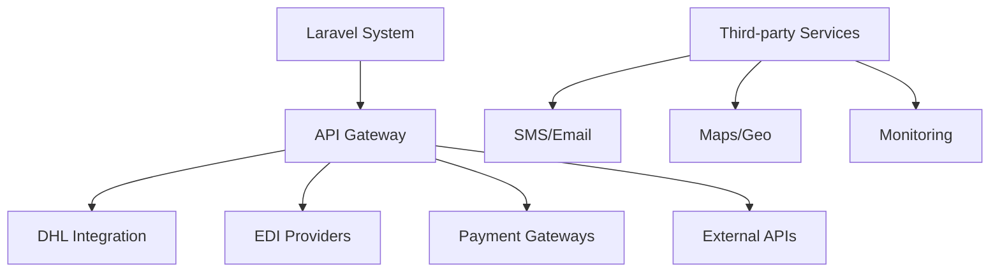

# Laravel Logistics System - Comprehensive Codebase Analysis

**Analysis Date:** November 7, 2025  
**Analysis Scope:** Database schema, API structure, pricing/contract functionality, integration points, and security features

## Executive Summary

This Laravel logistics system demonstrates a mature, enterprise-grade codebase with comprehensive functionality for managing shipments, customers, pricing, and contracts. The system has evolved from a traditional courier service to a modern logistics platform with advanced features including workflow management, analytics, and third-party integrations.

## 1. Database Schema Analysis

### Core Logistics Tables

#### Shipments Management
- **`shipments`**: Central shipment entity with status tracking, pricing, and metadata
- **`parcels`**: Individual packages within shipments
- **`scan_events`**: Event tracking for shipment lifecycle
- **`transport_legs`**: Multi-leg shipment tracking
- **`bags`**: Container management for shipment consolidation

#### Customer & Merchant Management
- **`customers`**: Comprehensive B2B customer profiles with credit limits, pricing tiers
- **`merchants`**: E-commerce merchants with payment processing
- **`users`**: System users (admin, drivers, customers)

#### Branch & Operations
- **`branches`**: Physical locations (hubs, local branches)
- **`branch_workers`**: Staff management with role-based permissions
- **`unified_branches`**: Multi-branch support architecture

#### Financial Infrastructure
- **`invoices`**: Billing and invoice management
- **`payments`**: Payment processing and tracking
- **`charge_lines`**: Detailed charge breakdowns
- **`settlements`**: Payment settlements and reconciliation

### Pricing & Contract Infrastructure

#### Existing Pricing Models
- **`rate_cards`**: Zone-based pricing with weight/dimension rules
- **`quotations`**: Customer quote management
- **`contracts`**: Customer pricing agreements
- **`surcharge_rules`**: Dynamic pricing adjustments

#### Key Relationships
```mermaid
erDiagram
    CUSTOMER ||--o{ SHIPMENT : creates
    CUSTOMER ||--o{ QUOTATION : requests
    CUSTOMER ||--o{ CONTRACT : has
    SHIPMENT ||--o{ CHARGE_LINE : contains
    RATE_CARD ||--o{ CHARGE_LINE : defines
    BRANCH ||--o{ SHIPMENT : origin/destination
```

## 2. Current Pricing & Contract Functionality

### Rate Card Management
The system includes sophisticated pricing logic through `RateCardManagementService`:

#### Features:
- **Zone-based pricing**: Distance calculation with branch relationship analysis
- **Customer tier discounts**: Platinum (15%), Gold (10%), Silver (5%), Standard (0%)
- **Service level pricing**: Express, Priority, Standard with different rates
- **Weight & dimension surcharges**: Automatic calculation for oversized shipments
- **Fuel surcharge application**: Dynamic fuel index integration
- **Tax calculation**: Automated tax computation

#### Pricing Tier Structure:
```php
'platinum' => ['percentage' => 15.0, 'type' => 'volume'],
'gold' => ['percentage' => 10.0, 'type' => 'volume'],
'silver' => ['percentage' => 5.0, 'type' => 'volume'],
'standard' => ['percentage' => 0.0, 'type' => 'standard']
```

### Contract Management
- **Contract model**: Customer-specific pricing agreements
- **SLA management**: Service level agreements in JSON format
- **Rate card association**: Link to specific rate cards
- **Status tracking**: Active, expired, suspended contract states

### Quotation System
- **Quote creation**: Customer quote generation with validity periods
- **PDF generation**: Quote document export
- **Surcharge breakdown**: Detailed cost component analysis
- **Currency support**: Multi-currency quote handling

## 3. API Structure Analysis

### API Architecture
The system implements a well-structured API with versioned endpoints:

#### API v1 (Legacy)
- **Authentication**: Device-bound API authentication
- **Shipment operations**: CRUD operations with idempotency
- **Tracking**: Public tracking endpoints
- **Client/Admin separation**: Role-based access control

#### API v10 (Current)
- **Comprehensive coverage**: 400+ endpoints across all modules
- **Module organization**: Logical grouping by functionality
- **Authentication**: Sanctum-based authentication
- **Rate limiting**: Built-in API rate limiting

#### Key API Modules:
```php
// Sales Module
Route::prefix('sales')->group(function () {
    Route::resource('customers', SalesCustomerController::class);
    Route::resource('quotations', SalesQuotationController::class);
    Route::resource('contracts', SalesContractController::class);
});

// Operations Module  
Route::prefix('operations')->group(function () {
    Route::get('dispatch-board', [OperationsControlCenterController::class, 'getDispatchBoard']);
    Route::post('assign-shipment', [OperationsControlCenterController::class, 'assignShipmentToWorker']);
});
```

### API Security Features
- **Idempotency handling**: Prevention of duplicate operations
- **Device binding**: Mobile API security
- **Role-based access**: Admin vs client permissions
- **Rate limiting**: API throttling
- **Request validation**: Comprehensive input validation

## 4. Integration Points

### External System Integrations

#### DHL Integration
- **`DHLComplianceService`**: Compliance checking and validation
- **`DHLSecurityMiddleware`**: Security middleware for DHL communications
- **`dhl_modules_tables`**: Custom tables for DHL-specific data

#### EDI Providers
- **`edi_providers` table**: Electronic Data Interchange provider management
- **`EDIProviderService`**: EDI communication handling
- **Multiple provider support**: Flexible EDI integration architecture

#### Payment Processing
- **Multiple payment gateways**: Stripe, PayPal, Aamarpay, Paytm, Skrill
- **`PaymentProcessingService`**: Centralized payment handling
- **COD management**: Cash-on-delivery processing

#### Third-Party Services
- **API Gateway**: Centralized API management and monitoring
- **Webhook management**: Event-driven integrations
- **SMS/Email services**: Communication services
- **Google Maps**: Location and routing services

### Integration Architecture


## 5. Security & Compliance Features

### Security Infrastructure

#### Authentication & Authorization
- **Multi-factor authentication**: `MfaService` implementation
- **Role-based access control**: Comprehensive RBAC system
- **Device binding**: API security for mobile clients
- **Session management**: Secure session handling

#### Data Protection
- **Encryption services**: `EncryptionService` for sensitive data
- **Data privacy compliance**: `DataPrivacyService` implementation
- **GDPR compliance**: Privacy consent management
- **KYC compliance**: Customer verification systems

#### Audit & Monitoring
- **Audit trail**: `SecurityAuditLog` for all operations
- **Security monitoring**: Real-time security event monitoring
- **Activity logging**: Comprehensive activity tracking
- **Permission management**: Fine-grained permission control

### Compliance Features
- **Financial compliance**: SOX, PCI DSS compliance
- **Data protection**: GDPR, CCPA compliance
- **KYC/AML**: Customer due diligence
- **Regulatory reporting**: Automated compliance reporting

## 6. Implementation Recommendations

### For New Pricing/Quotation/Contracts System

#### Database Enhancements
1. **Enhanced Contract Management**
   ```sql
   -- Add to existing contracts table
   ALTER TABLE contracts ADD COLUMN pricing_formula JSON;
   ALTER TABLE contracts ADD COLUMN min_volume_commitment DECIMAL(12,2);
   ALTER TABLE contracts ADD COLUMN volume_discount_tiers JSON;
   ```

2. **Advanced Quotation System**
   ```sql
   -- Enhanced quotations table
   ALTER TABLE quotations ADD COLUMN quote_template_id INT;
   ALTER TABLE quotations ADD COLUMN automated_pricing BOOLEAN DEFAULT FALSE;
   ALTER TABLE quotations ADD COLUMN competitor_rates JSON;
   ```

3. **Dynamic Pricing Rules**
   ```sql
   -- New pricing rules table
   CREATE TABLE pricing_rules (
       id BIGINT PRIMARY KEY AUTO_INCREMENT,
       rule_name VARCHAR(255) NOT NULL,
       conditions JSON NOT NULL,
       adjustments JSON NOT NULL,
       priority INT DEFAULT 10,
       is_active BOOLEAN DEFAULT TRUE
   );
   ```

#### Service Layer Enhancements

1. **Enhanced Pricing Engine**
   ```php
   class AdvancedPricingEngine
   {
       public function calculateDynamicRate(Shipment $shipment, Customer $customer): array
       {
           // Implement real-time pricing with multiple factors
           $baseRate = $this->getBaseRate($shipment);
           $customerDiscount = $this->getCustomerSpecificDiscount($customer, $shipment);
           $volumeDiscount = $this->calculateVolumeDiscount($customer);
           $competitorAdjustment = $this->getCompetitorAdjustment($shipment->route);
           
           return $this->compileFinalRate($baseRate, $customerDiscount, $volumeDiscount, $competitorAdjustment);
       }
   }
   ```

2. **Contract Lifecycle Management**
   ```php
   class ContractLifecycleService
   {
       public function autoRenewContract(Contract $contract): bool
       {
           // Automated contract renewal with escalation
       }
       
       public function calculateRenewalTerms(Contract $contract): array
       {
           // Calculate renewal pricing based on performance
       }
   }
   ```

3. **Quote Automation System**
   ```php
   class QuoteAutomationService
   {
       public function generateAutomatedQuote(array $requirements): Quotation
       {
           // AI-powered quote generation
       }
       
       public function validateQuotePricing(Quotation $quote): bool
       {
           // Validate quote against current rates and rules
       }
   }
   ```

#### API Enhancements

1. **Pricing API Endpoints**
   ```php
   Route::prefix('pricing')->group(function () {
       Route::get('calculate', [PricingController::class, 'calculate']);
       Route::post('bulk-calculate', [PricingController::class, 'bulkCalculate']);
       Route::get('rules', [PricingController::class, 'getPricingRules']);
       Route::post('rules', [PricingController::class, 'createPricingRule']);
   });
   ```

2. **Contract API Enhancements**
   ```php
   Route::prefix('contracts')->group(function () {
       Route::post('templates', [ContractController::class, 'createTemplate']);
       Route::post('auto-renew', [ContractController::class, 'autoRenew']);
       Route::get('analytics', [ContractController::class, 'getAnalytics']);
   });
   ```

#### UI/UX Enhancements

1. **Pricing Calculator Interface**
   - Real-time pricing calculator
   - Visual rate breakdown
   - Competitor comparison
   - Volume discount visualization

2. **Contract Management Dashboard**
   - Contract lifecycle visualization
   - Renewal alerts and notifications
   - Performance analytics
   - Automated workflows

3. **Quote Management System**
   - Template-based quote creation
   - Automated follow-up emails
   - Quote-to-contract conversion
   - Performance tracking

### Integration Strategy

#### Phase 1: Core Enhancements
1. **Database Schema Updates**
2. **Enhanced Pricing Engine**
3. **Basic API Endpoints**

#### Phase 2: Advanced Features
1. **AI-Powered Quote Generation**
2. **Contract Lifecycle Management**
3. **Real-time Pricing Adjustments**

#### Phase 3: Analytics & Optimization
1. **Pricing Analytics Dashboard**
2. **Customer Value Analysis**
3. **Automated Optimization**

## 7. System Strengths

### Architecture Strengths
1. **Modular Design**: Well-separated concerns with services, models, and controllers
2. **Scalable Database**: Proper indexing and relationship design
3. **API-First Approach**: Comprehensive REST API coverage
4. **Security-First**: Built-in security and compliance features
5. **Integration Ready**: Multiple external integration points

### Business Logic Strengths
1. **Comprehensive Pricing Logic**: Sophisticated rate calculation engine
2. **Customer Segmentation**: Multi-tier customer management
3. **Workflow Management**: Advanced shipment lifecycle tracking
4. **Financial Management**: Complete billing and settlement system

## 8. Areas for Enhancement

### Technical Improvements
1. **Microservices Migration**: Consider breaking into microservices for better scalability
2. **Caching Strategy**: Implement Redis caching for frequently accessed pricing data
3. **Event Sourcing**: Consider event sourcing for audit trail improvements
4. **API Documentation**: Enhanced API documentation and testing

### Business Logic Enhancements
1. **AI-Powered Pricing**: Machine learning for dynamic pricing optimization
2. **Predictive Analytics**: Customer behavior prediction and churn analysis
3. **Real-time Optimization**: Automated route and pricing optimization
4. **Advanced Reporting**: Enhanced analytics and business intelligence

## 9. Implementation Priority Matrix

| Feature | Business Impact | Technical Complexity | Priority |
|---------|----------------|---------------------|----------|
| Enhanced Pricing Engine | High | Medium | P0 |
| Contract Lifecycle Management | High | Low | P0 |
| Automated Quote Generation | Medium | High | P1 |
| Real-time Pricing Adjustments | Medium | Medium | P1 |
| Advanced Analytics Dashboard | Low | High | P2 |

## 10. Conclusion

The Laravel logistics system demonstrates excellent foundational architecture with comprehensive business logic coverage. The existing pricing, quotation, and contract functionality provides a solid base for enhancement. The recommended improvements focus on:

1. **Leveraging existing infrastructure** while adding advanced features
2. **Maintaining backwards compatibility** during enhancement phases
3. **Implementing scalable solutions** for future growth
4. **Enhancing user experience** through better interfaces and automation

The system is well-positioned to implement a modern, feature-rich pricing, quotation, and contracts system that will significantly enhance business capabilities and customer satisfaction.

---

**Report Prepared By:** Kilo Code - Technical Analysis Team  
**Next Steps:** Review recommendations and proceed with implementation planning