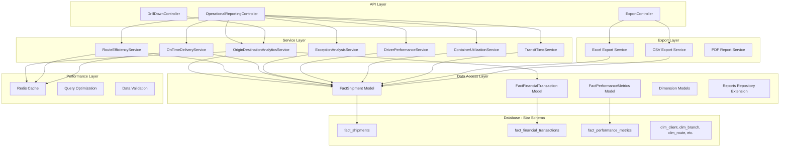

# Operational Reporting Module Architecture

## System Overview
The Operational Reporting Module builds upon the existing Reports repository and star schema database design to provide comprehensive real-time analytics for logistics operations.

## Architecture Components



## Core Service Classes

### 1. OriginDestinationAnalyticsService
- **Purpose**: Volume tracking by origin-destination pairs
- **Key Methods**:
  - `getVolumeAnalytics($filters)`
  - `generateHeatMapData($dateRange)`
  - `getRouteVolumeTrends($routeId)`
  - `exportGeographicData($format)`

### 2. RouteEfficiencyService
- **Purpose**: Route performance scoring and bottleneck identification
- **Key Methods**:
  - `calculateEfficiencyScore($routeId, $dateRange)`
  - `identifyBottlenecks($filters)`
  - `getPerformanceComparison($routes)`
  - `generateOptimizationRecommendations($routeId)`

### 3. OnTimeDeliveryService
- **Purpose**: Delivery rate calculations and variance analysis
- **Key Methods**:
  - `calculateOnTimeRate($filters)`
  - `performVarianceAnalysis($dateRange)`
  - `getHistoricalTrends($period)`
  - `monitorSLACompliance($clientId)`

### 4. ExceptionAnalysisService
- **Purpose**: Exception categorization and root cause analysis
- **Key Methods**:
  - `categorizeExceptions($filters)`
  - `performRootCauseAnalysis($exceptionId)`
  - `calculateExceptionFrequency($period)`
  - `generatePreventiveActions($exceptionType)`

### 5. DriverPerformanceService
- **Purpose**: Driver metrics and compliance tracking
- **Key Methods**:
  - `calculateStopsPerHour($driverId, $dateRange)`
  - `trackMilesPerGallon($driverId)`
  - `monitorHoursOfService($driverId)`
  - `generateDriverRanking($period)`

### 6. ContainerUtilizationService
- **Purpose**: Baggage/container optimization
- **Key Methods**:
  - `calculateUtilizationRate($containerId)`
  - `generateOptimizationSuggestions($routeId)`
  - `performCapacityPlanning($dateRange)`
  - `analyzeCostEfficiency($containerId)`

### 7. TransitTimeService
- **Purpose**: Transit analysis and bottleneck identification
- **Key Methods**:
  - `calculateAverageTransitTime($routeId)`
  - `identifyTransitBottlenecks($filters)`
  - `performVarianceAnalysis($dateRange)`
  - `benchmarkPerformance($carriers)`

## API Endpoints Structure

### Operational Reporting APIs
```
GET /api/v1/reports/operational/volumes
GET /api/v1/reports/operational/route-efficiency
GET /api/v1/reports/operational/on-time-delivery
GET /api/v1/reports/operational/exceptions
GET /api/v1/reports/operational/driver-performance
GET /api/v1/reports/operational/container-utilization
GET /api/v1/reports/operational/transit-times
```

### Export APIs
```
GET /api/v1/reports/export/volumes/{format}
GET /api/v1/reports/export/efficiency/{format}
GET /api/v1/reports/export/delivery/{format}
```

### Drill-Down APIs
```
GET /api/v1/reports/drilldown/shipment/{shipmentId}
GET /api/v1/reports/drilldown/route/{routeId}
GET /api/v1/reports/drilldown/driver/{driverId}
```

## Key Features

### Real-Time Analytics
- Live data processing and aggregation
- Real-time performance monitoring
- Instant exception detection and alerts

### Geographic Heat Mapping
- Interactive volume visualization
- Route density analysis
- Geographic bottleneck identification

### Advanced Analytics
- Machine learning-based efficiency scoring
- Predictive analytics for capacity planning
- Statistical variance analysis

### Performance Optimization
- Redis caching for fast data retrieval
- Query optimization for large datasets
- Background job processing for heavy analytics

### Data Export
- Multiple format support (Excel, CSV, PDF)
- Scheduled report generation
- Custom report templates

### Drill-Down Functionality
- Aggregate to detailed view navigation
- Contextual filtering and analysis
- Interactive data exploration

## Technology Stack
- **Framework**: Laravel 8+
- **Database**: MySQL/PostgreSQL with star schema
- **Caching**: Redis
- **Export**: Laravel Excel, TCPDF
- **Authentication**: Laravel Sanctum
- **Testing**: PHPUnit, Laravel Dusk
- **Documentation**: OpenAPI/Swagger